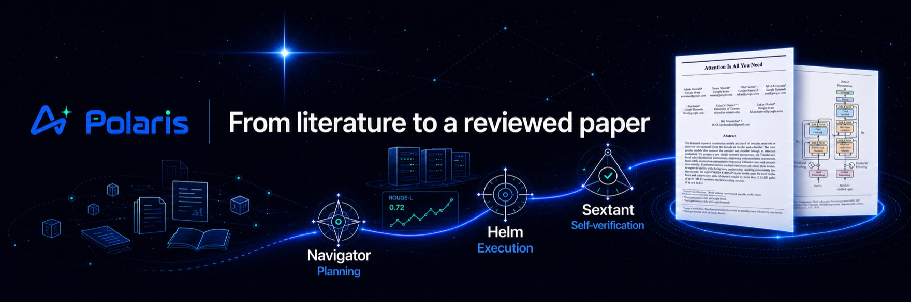

<p align="center">
  
</p>

<p align="center">
  <strong>Autonomous, end-to-end AI research: from literature to a reviewed paper.</strong><br>
  Resumable, auditable, human-gated agent runs, with deterministic pipelines doing the heavy lifting and LLMs reserved for judgement.
</p>

<p align="center">
  
  
  
  
  
  
  
  
  
  
</p>

<p align="center">
  
</p>

---

Polaris runs the entire research lifecycle as a single web application: literature survey, idea
generation, idea review, experiment building on real GPU servers, LaTeX paper writing, and paper
review. It is built for a research lab, with multi-user access, RBAC, and invite-code registration, and
it treats every long task as a **Voyage**: a persisted, resumable, human-gated agent run that can span
hours or days without losing state.

> [!NOTE]
> Polaris is not a chatbot wrapper. The heavy lifting (crawling, parsing, deduplication, metric parsing,
> citation matching) is deterministic code. LLMs are reserved for the judgement calls: scoring,
> synthesis, drafting, and review. This split keeps runs cheap, reproducible, and auditable.

## The research pipeline

Polaris models research as six stages. Each stage produces durable artifacts that the next stage
consumes, and every hand-off can pause at a human approval gate.


| Stage | What Polaris actually does |
| --- | --- |
| **Literature** | The Research Wiki ingests papers from OpenAlex, Semantic Scholar, and arXiv. Cold start snowballs citations from anchor papers, scores relevance against a project rubric, extracts full text (PyMuPDF), and compiles each paper into a cross-linked wiki page (TL;DR, method, reusable ideas, concept backlinks). Incremental daily sync with watermark resume; pgvector semantic search; one-click Obsidian vault export. |
| **Idea** | Idea Forge runs multi-signal gap analysis over the knowledge base (concept co-occurrence holes, extracted paper limitations, trend velocity, survey gaps) to drive retrieval-planned idea generation. Ideas are scored on four axes (novelty, feasibility, operability, impact), deduplicated semantically, and funneled to a candidate pool. A deep Research Proposal builder then hardens the winner with a plan-execute-verify loop. |
| **Idea Review** | Configurable-persona reviewer agents debate pairwise; a judge produces an Elo tournament ranking. Lab members join the discussion live over WebSocket, and their comments enter the agent context as first-class input. |
| **Experiment** | The Experiment Lab uses per-user, Fernet-encrypted SSH credentials to reach the lab's GPU servers. An experiment Voyage plans the study, passes a compute-budget gate, writes code, runs a smoke test, launches runs with streamed logs and live metric curves, then auto-iterates: parse metrics, reflect, then improve, debug, or stop. Figures are generated and VLM-checked. |
| **Paper Writing** | The Paper Writer opens a multi-file LaTeX project (NeurIPS, ICLR, ACL templates) with a CodeMirror 6 editor, real-time collaborative editing (CRDT), and server-side tectonic compilation to a live PDF preview. An agent drafts section by section, but experiment numbers may only come from real `ExperimentRun` metrics and citations must map to real knowledge-base entries. |
| **Paper Review** | Line-by-line citation verification (existence: exact, minor, or fabricated; support: supported, partial, or unsupported) plus deterministic fact-checking of every number against the experiment record, then multi-perspective top-venue reviewer agents and a meta-review. A fabricated citation forces a non-pass. |

## The Voyage agent core

Research tasks are long-running by nature: a cold-start literature backfill takes hours, an experiment
runs for days. Polaris's central abstraction is that every complex task is a Voyage: a resumable,
auditable run driven by a persisted three-part loop.

| Component | Role |
| --- | --- |
| **Navigator** | Planning. Decomposes a goal into a step plan with sub-goals, dependencies, and budget. In loop mode it edits the plan incrementally as evidence arrives, rather than replanning from scratch. |
| **Helm** | Execution. Runs a single step (LLM calls, tool calls, SSH remote ops, literature-API queries) and returns an observation. |
| **Sextant** | Self-verification. Checks each step against structured acceptance criteria (exit code, artifact exists, schema valid, metric threshold, count, LLM rubric). Deterministic checks run first; failures feed diagnostics back to Navigator, and repeated failure escalates to a human gate. |

> [!IMPORTANT]
> A Voyage is backed by a persistent state machine (`planning -> executing -> verifying -> ...`). If a
> worker crashes mid-run, the Voyage resumes from its last checkpoint after a health check. Budgets are
> attached to the run and auto-pause it when exceeded; every plan, action, and verdict is retained and
> replayable in the UI.

Not every task needs the full cognitive loop. A shared **Runtime** shell (state machine, checkpointing,
gates, budget, cancellation, event streaming) serves all task kinds, while the **Brain** (the full
plan-execute-verify loop) activates only for open-ended kinds such as experiments. Predictable pipelines
(wiki compile, idea review, paper drafting) run on fixed templates instead of being over-orchestrated.

## Key features

- **Research Wiki, "compile, don't retrieve."** LLMs read papers and compile a persistent, cross-linked
  knowledge base up front, instead of doing on-demand RAG at query time. Exports to an Obsidian vault
  with `[[wikilinks]]` and frontmatter.
- **Idea Forge.** Signal-driven gap analysis, four-axis scoring, semantic dedup, and a deep
  Research-Proposal builder with novelty double-checking against the library and external sources.
- **Multi-agent and human review.** Persona reviewer agents debate to an Elo ranking; humans join live
  and are injected into the agent context, not bolted on afterward.
- **Experiment Lab over SSH.** Agents write and run code on real GPU servers, iterate on metrics, and
  collect logs and figures, under gated remote writes, command allow/deny lists, full audit, and triple
  budget caps (total, per-run, concurrency).
- **Paper Writer.** Online multi-file LaTeX with collaborative CRDT editing and server-side tectonic
  compilation; agent drafting bound to real metrics and real citations.
- **Paper Review with citation verification.** Existence and support are checked per citation against the
  library, Semantic Scholar, and OpenAlex; numbers are fact-checked against the experiment record.
- **Skill system.** Agent behavior is packaged as data, not code: versionable, composable `guidance`,
  `rubric`, `persona`, and `workflow` packs injected at named points into agent prompts, with a
  publish-approve-install-rate marketplace. Each Voyage snapshots the skills it used for reproducibility.
- **MCP tool layer.** A single registry of read-only tools (literature, knowledge, project state,
  external search) is exposed both internally to the agent loop and externally as an **MCP server**
  (Streamable HTTP and stdio) for Claude Desktop and Cursor. Project-isolated and strictly read-only.
- **Real-time everywhere.** SSE for agent streaming and Voyage progress; WebSocket for review
  discussions, approval notifications, experiment log tracking, and collaborative editing.
- **Multi-user and RBAC.** JWT auth (fastapi-users), invite-code registration, role-based access, and
  per-call token/cost accounting attributed to user, project, and voyage.
- **LLM abstraction and model routing.** All model calls go through one layer; a DB-backed routing table
  maps each research stage to a provider and model (cheap models for scoring, strong models for debate
  and drafting), editable from an admin panel.

## Tech stack

| Layer | Technology |
| --- | --- |
| Frontend | React 18 + TypeScript 5 + Vite 5, TanStack Query for all server state, CodeMirror 6, Yjs (CRDT), react-pdf, KaTeX |
| Backend | FastAPI (fully async) + SQLAlchemy 2 + Alembic + fastapi-users (JWT) |
| Task queue | ARQ (Redis broker); every long task runs off the request thread |
| Data | PostgreSQL 16 with pgvector + Redis 7 |
| Remote execution | asyncssh to GPU servers; SSH keys encrypted at rest with Fernet |
| LaTeX | tectonic, server-side, with a cached macro volume |
| LLM | Multi-provider abstraction (OpenAI-compatible and Anthropic) with a DB model-routing table |
| Deployment | Docker Compose (postgres, redis, api, worker, frontend) |

## Quick start

> [!TIP]
> The Docker path needs only Docker and Docker Compose installed; no local Python, Node, or database.

```bash
cp .env.example .env        # set provider keys and secrets
make dev                    # full stack via docker compose, hot reload
```

- Frontend: <http://localhost:5173>
- Backend API docs: <http://localhost:8000/docs>

Local development without Docker (falls back to SQLite):

```bash
make backend-dev            # venv + uvicorn on :8000
make frontend-dev           # npm install + vite dev on :5173
```

Common tasks:

```bash
make migrate                # alembic upgrade head
make test                   # backend pytest + frontend build
make lint                   # ruff check + tsc --noEmit
```

> [!WARNING]
> The Experiment Lab connects to real GPU servers over SSH and runs generated code there. Remote writes
> pass through human approval gates and command allow/deny lists, but you should still point Polaris only
> at machines you control and review the audit log.

## Repository layout

```text
backend/
  app/
    api/         thin FastAPI routers (no business logic)
    services/    business logic (ingest, wiki, ideas, review, experiments, manuscripts, ...)
    models/      SQLAlchemy models
    agents/
      voyage/    the Voyage engine: navigator, helm, sextant, checks, tool_loop, per-domain actions
    core/        config, db, redis, queue (ARQ), events (SSE), security (Fernet), llm/ abstraction
    tools/       MCP-shared read-only tool registry
    mcp/         external MCP server (Streamable HTTP and stdio)
  worker/        ARQ worker
  tests/
frontend/
  src/features/  one folder per product area: wiki, reading, forge, review,
                 experiment, writer, paper-review, voyages, skills, mcp, settings, ...
deploy/          Dockerfiles and compose (dev override and prod)
docs/            architecture, per-module API contracts, design docs
```

Start with [docs/architecture.md](docs/architecture.md) for the full design, and the `docs/api-*.md`
files for per-module API contracts.

## Architecture principles

- **Strict layering.** `api/` (thin routers) then `services/` (business logic) then `models/`. Routers
  hold no business logic; services never import FastAPI.
- **Deterministic vs. judgemental split.** Deterministic work is plain code or worker tasks; only
  judgement calls reach an LLM.
- **One LLM boundary.** All model calls go through `app/core/llm/`; no direct SDK imports in business
  code; model choice comes from the DB routing table.
- **Async all the way down.** asyncpg, httpx.AsyncClient, asyncssh throughout.
- **Secrets encrypted at rest** with Fernet; no secrets in logs; every remote write is gated.

## Contributing

See [CONTRIBUTING.md](CONTRIBUTING.md). In short: one feature = one branch = one worktree = one pull
request, branched from the latest `origin/main`; English conventional-commit messages; `main` stays a
read-only fast-forward mirror of `origin/main`. Conventions for code, i18n, and design tokens live in
[CLAUDE.md](CLAUDE.md).

## License

This is an internal research project of the ZJU REAL Lab and is not yet released under a public license.
Please contact the maintainers before reuse.
