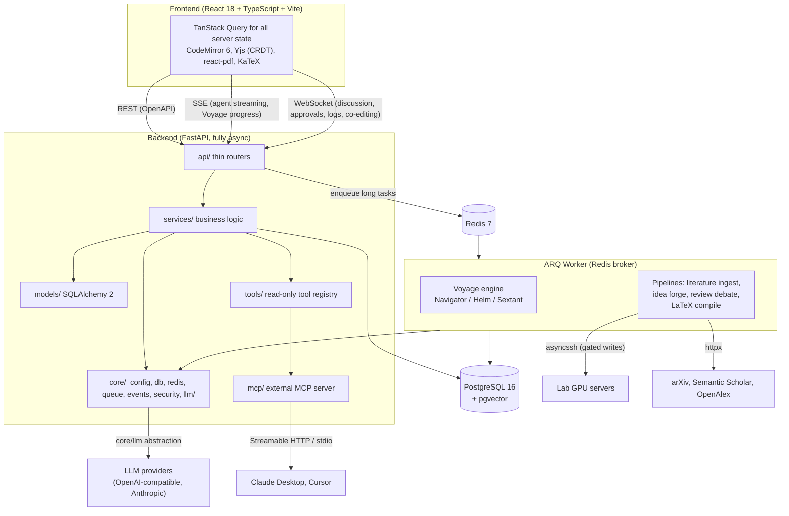

# Architecture

This is a conceptual overview of how Polaris is put together. For the concepts a user works with
(the pipeline stages, Voyages, skills, tools), see [Core Concepts](concepts.md). For running the
system, see [Getting Started](getting-started.md) and [Deployment](deployment.md).

## The big picture

Polaris is a monorepo with three parts:

- A React + Vite frontend that talks to the backend over REST (OpenAPI), Server-Sent Events (SSE),
  and WebSocket.
- A fully async FastAPI backend organized in strict layers, plus an ARQ worker that runs every long
  task off the request thread.
- PostgreSQL (with the pgvector extension) as the system of record, and Redis as the task broker and
  cache.

## Layered backend

The backend follows one strict rule: `api/` (thin routers) then `services/` (business logic) then
`models/` (SQLAlchemy). Routers hold no business logic, and services never import FastAPI. This keeps
the HTTP surface thin and makes the business logic reusable from both request handlers and worker
tasks.

- `api/` exposes REST endpoints (all under `/api`), authenticated with JWT via fastapi-users, with
  RBAC and invite-code registration. Project-scoped endpoints verify membership.
- `services/` holds the actual work: literature ingest, wiki compilation, idea forge, review, SSH
  experiment execution, manuscript editing and compilation, skills, and so on.
- `models/` holds the SQLAlchemy 2 models. Migrations are managed with Alembic.
- `core/` holds cross-cutting infrastructure: configuration, the database and Redis clients, the ARQ
  queue, the SSE event bus, Fernet-based security, and the LLM abstraction layer.

## The ARQ worker and long tasks

Research tasks are long-running by nature: a cold-start literature backfill takes hours, an experiment
runs for days. Nothing long happens in the request thread. Instead the API enqueues work onto ARQ
(with Redis as the broker) and the worker process runs it. The worker hosts:

- The Voyage engine (Navigator / Helm / Sextant), described in [Core Concepts](concepts.md).
- Deterministic pipelines: literature ingest, idea forge, review debate, and LaTeX compilation.
- The SSH executor that reaches the lab's GPU servers via asyncssh.

Because Voyages persist their state, a worker that restarts mid-run resumes from its last checkpoint
after a health check rather than starting over.

## The LLM abstraction and model routing

All model calls go through a single boundary, `app/core/llm/`, which exposes a uniform
`complete()` / `stream()` interface over multiple providers (OpenAI-compatible endpoints such as
DeepSeek or Qwen, and Anthropic). Business code never imports a provider SDK directly.

Model choice is not hard-coded. A DB-backed routing table maps each research stage to a provider and
model, so cheap models can score literature while strong models handle idea debate and paper
drafting. The routing table is editable from the admin panel. Every call is metered: tokens and cost
are attributed to the user, project, and Voyage.

## Deterministic vs. judgemental split

This is the principle that keeps runs cheap, reproducible, and auditable. Deterministic work
(crawling, parsing, deduplication, watermark-based incremental sync, metric parsing, citation
matching) is written as ordinary code or worker tasks. Only the judgement calls (relevance scoring,
synthesis, drafting, review) reach an LLM. Guardrails such as "experiment numbers may only come from
real run metrics" and "citations must map to real knowledge-base entries" live in code and cannot be
overridden by prompts or skills.

## Data stores

- **PostgreSQL 16 with pgvector** is the system of record: users, projects, papers and concepts,
  ideas, review sessions, experiments and runs, manuscripts, gates, activity, and Voyage runs and
  steps. pgvector powers semantic search over papers and full-text chunks.
- **Redis 7** is the ARQ broker and a cache.
- A **file volume** holds PDFs and generated artifacts (mounted at `/srv/data` in containers), kept
  out of the code tree so it does not trigger reloads.

## Real-time channels

- **SSE** carries one-way streams: agent token output and Voyage progress. A periodic heartbeat keeps
  proxies from dropping the connection.
- **WebSocket** carries bidirectional traffic: review discussions (where human comments enter the
  agent context as first-class input), approval notifications, live experiment log tracking, and
  CRDT-based collaborative editing of manuscripts.

## The Voyage agent core

The central abstraction is that every complex task is a **Voyage**: a resumable, auditable run backed
by a persistent state machine. A shared runtime shell (state machine, checkpointing, gates, budget,
cancellation, event streaming) serves all task kinds, while the full plan-execute-verify brain
(Navigator plans, Helm executes, Sextant verifies) activates only for open-ended kinds such as
experiments. Predictable pipelines (wiki compile, idea review, paper drafting) run on fixed templates
instead of being over-orchestrated. See [Core Concepts](concepts.md#the-voyage-long-running-agent)
for the full explanation.

## Deployment shape

Production runs as Docker Compose services: `postgres`, `redis`, `api`, `worker`, and `frontend`
(served by nginx, which reverse-proxies `/api` with SSE buffering disabled and `/ws` with the
WebSocket upgrade). See [Deployment](deployment.md) for the full procedure.
