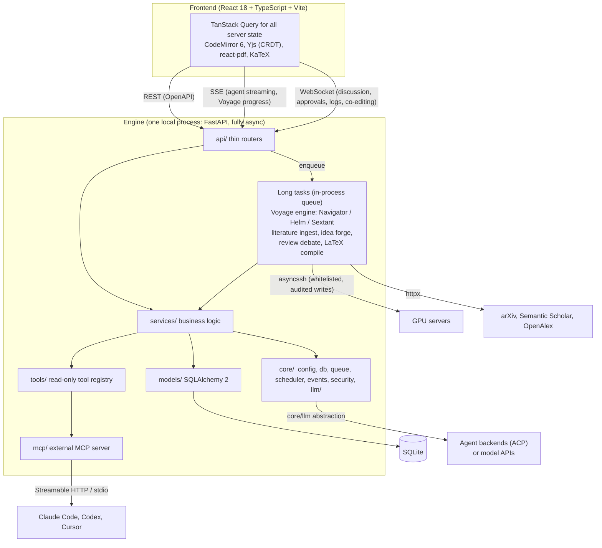

# Architecture

This is a conceptual overview of how Polaris is put together. For the concepts a user works with
(the pipeline stages, Voyages, skills, tools), see [Core Concepts](concepts.md). For installing and
running it, see [Getting Started](getting-started.md) and [Desktop](desktop.md).

## One form: the desktop app and its local engine

Polaris ships as a desktop app only. The Electron app hosts a plugin kernel (`@polaris/kernel`, a
cordis runtime) in its main process; the kernel's `legacy-engine` plugin bootstraps and supervises
the FastAPI backend as a **single local process** — the engine. The engine keeps everything in one
process on the user's computer:

- **SQLite** as the database;
- an **in-process task queue** for long tasks;
- an **in-process stand-in for Redis** (fakeredis) for pub/sub, the event streams, and small caches;
- an **in-process scheduler** for periodic jobs;
- a **local session** instead of a login: whoever uses the app is the owner.

No database server, broker, or worker process runs next to it. See [Desktop](desktop.md) for how the
app sets the engine up and where the data lives. (Earlier releases also ran as a multi-user server
with separate API, worker, Postgres, and Redis processes; that form was retired in #842.)

## The big picture

Polaris is a monorepo with these parts:

- A React + Vite frontend that talks to the engine over REST (OpenAPI), Server-Sent Events (SSE),
  and WebSocket, on the loopback address.
- The engine: a fully async FastAPI backend organized in strict layers, which runs long tasks on its
  in-process queue, off the request path.
- The Electron shell and the plugin kernel that start the engine and host plugins.

```mermaid
flowchart TB
    subgraph client["Frontend (React 18 + TypeScript + Vite)"]
      UI["TanStack Query for all server state\nCodeMirror 6, Yjs (CRDT), react-pdf, KaTeX"]
    end

    UI -- "REST (OpenAPI)" --> API
    UI -- "SSE (agent streaming, Voyage progress)" --> API
    UI -- "WebSocket (discussion, approvals, logs, co-editing)" --> API

    subgraph engine["Engine (one local process: FastAPI, fully async)"]
      API["api/  thin routers"]
      SVC["services/  business logic"]
      MODELS["models/  SQLAlchemy 2"]
      CORE["core/  config, db, queue, scheduler, events, security, llm/"]
      TOOLS["tools/  read-only tool registry"]
      MCP["mcp/  external MCP server"]
      TASKS["Long tasks (in-process queue)\nVoyage engine: Navigator / Helm / Sextant\nliterature ingest, idea forge,\nreview debate, LaTeX compile"]
      API --> SVC --> MODELS
      SVC --> CORE
      SVC --> TOOLS
      TOOLS --> MCP
      API -- "enqueue" --> TASKS
      TASKS --> SVC
    end

    MODELS --> DB[("SQLite")]
    CORE -- "core/llm abstraction" --> LLM["Agent backends (ACP)\nor model APIs"]
    TASKS -- "asyncssh (whitelisted, audited writes)" --> GPU["GPU servers"]
    TASKS -- "httpx" --> LIT["arXiv, Semantic Scholar, OpenAlex"]
    MCP -- "Streamable HTTP / stdio" --> EXT["Claude Code, Codex, Cursor"]
```

## Layered backend

The backend follows one strict rule: `api/` (thin routers) then `services/` (business logic) then
`models/` (SQLAlchemy). Routers hold no business logic, and services never import FastAPI. This keeps
the HTTP surface thin and makes the business logic reusable from both request handlers and
background tasks.

- `api/` exposes REST endpoints (all under `/api`), authenticated with JWT via fastapi-users; the
  frontend fetches a local session from the engine, so there is nothing to type in. Project-scoped
  endpoints verify ownership.
- `services/` holds the actual work: literature ingest, wiki compilation, idea forge, review, SSH
  experiment execution, manuscript editing and compilation, skills, and so on.
- `models/` holds the SQLAlchemy 2 models. Migrations are managed with Alembic; the desktop app
  applies them every time it starts the engine.
- `core/` holds cross-cutting infrastructure: configuration, the database, the in-process Redis
  stand-in, the task queue, the scheduler, the SSE event bus, Fernet-based security, and the LLM
  abstraction layer.
- `worker/tasks.py` (a separate package for historical reasons) holds the long-task functions the
  queue runs.

## Long tasks and periodic jobs

Research tasks are long-running by nature: a cold-start literature backfill takes hours, an experiment
runs for days. Nothing long happens in the request handler. Instead the API enqueues work onto the
in-process task queue (`app/core/queue.py`), which runs it as a background task in the same process.
Long tasks include:

- The Voyage engine (Navigator / Helm / Sextant), described in [Core Concepts](concepts.md).
- Deterministic pipelines: literature ingest, idea forge, review debate, and LaTeX compilation.
- The SSH executor that reaches GPU servers via asyncssh.

The engine scheduler (`app/core/scheduler.py`) runs the periodic jobs while the app is open: the
daily paper sync, scheduled literature discovery, publication matching, recovery of stale runs, and
a watchdog for remote commands nobody answered — each every few minutes, and each deciding for itself
whether it is due. Once at startup it also re-queues runs a crash or quit left in flight. A job never
overlaps itself, and a failure is logged without stopping its loop.

Because Voyages persist their state, a run cut off by a crash or by quitting the app resumes from its
last checkpoint on the next start rather than starting over.

## The LLM abstraction and model routing

All model calls go through a single boundary, `app/core/llm/`, which exposes a uniform
`complete()` / `stream()` interface over agent backends (Claude Code, Codex and other ACP agents —
see [Agent backends](agents.md)) and model APIs (OpenAI-compatible endpoints such as DeepSeek or
Qwen, the OpenAI Responses API, and Anthropic). Business code never imports a provider SDK directly.

Model choice is not hard-coded. A DB-backed routing table maps each research stage to an agent or a
provider and model, so cheap models can score literature while strong models handle idea debate and
paper drafting. The routing table is editable under Settings → Models & agents. Every call is
metered: tokens and cost are attributed to the project and Voyage.

## Deterministic vs. judgemental split

This is the principle that keeps runs cheap, reproducible, and auditable. Deterministic work
(crawling, parsing, deduplication, watermark-based incremental sync, metric parsing, citation
matching) is written as ordinary code or background tasks. Only the judgement calls (relevance scoring,
synthesis, drafting, review) reach an LLM. Guardrails such as "experiment numbers may only come from
real run metrics" and "citations must map to real knowledge-base entries" live in code and cannot be
overridden by prompts or skills.

## Data stores

- **SQLite** is the system of record: projects, papers and concepts, ideas, review sessions,
  experiments and runs, manuscripts, gates, activity, and Voyage runs and steps. The desktop app
  keeps it at `engine/polaris.db` in its user-data folder and snapshots it before each migration.
  Vector search over papers and chunks needs PostgreSQL's pgvector, so on SQLite semantic search
  falls back to keyword search (see [Embedding & retrieval](embedding-and-retrieval.md)).
- An **in-process Redis stand-in** (fakeredis) carries pub/sub for the live event streams and small
  caches. It lives in memory, so its contents are gone after a restart.
- A **data folder** (`POLARIS_DATA_DIR`) holds PDFs, exports, experiment logs, and the file
  projection, kept out of the code tree.

## Real-time channels

- **SSE** carries one-way streams: agent token output and Voyage progress. A periodic heartbeat keeps
  the connection alive.
- **WebSocket** carries bidirectional traffic: review discussions (where human comments enter the
  agent context as first-class input), approval notifications, live experiment log tracking, and
  CRDT-based collaborative editing of manuscripts.

## The Voyage agent core

The central abstraction is that every complex task is a **Voyage**: a resumable, auditable run backed
by a persistent state machine. A shared runtime shell (state machine, checkpointing, gates, budget,
cancellation, event streaming) serves all task kinds, while the full plan-execute-verify brain
(Navigator plans, Helm executes, Sextant verifies) activates only for open-ended kinds such as
experiments. Predictable pipelines (wiki compile, idea review, paper drafting) run on fixed templates
instead of being over-orchestrated. See [Core Concepts](concepts.md#the-voyage-long-running-agent)
for the full explanation.
