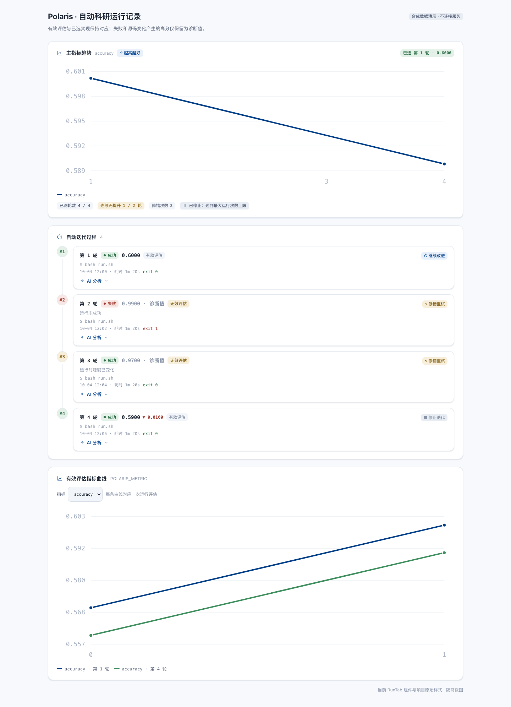

# Evidence-bound automatic research

An experiment task now separates execution, candidate selection, and observational conclusions.
A task can finish with valid negative results or an inconclusive scientific outcome. A score alone
does not establish causality, generalization, or statistical significance.

The existing `plan → setup → smoke → run → analyze` Voyage remains the controller. These additions
make its decisions and final delivery refer to the same implementation and evidence.

## Contract and baseline

`experiment.plan` freezes the original objective and Idea metadata/goal, claims, exact metric selector/direction,
conditions, declared datasets/evaluation protocol, allowed source paths, and budget in
`Experiment.iteration_state.research_contract`. Protected source digests are finalized from the
initial candidate before its first run. Incoming model hypothesis statuses start as `testing`.
Changing evaluation scope or a protected evaluator requires a new experiment/protocol and baseline;
scores from different identities cannot be treated as improvement.

Optional plan fields:

```json
{
  "primary_metric": {
    "name": "accuracy",
    "selector": "accuracy/model/treatment",
    "direction": "maximize",
    "min_delta": 0.005
  },
  "conditions": [
    {"name": "baseline", "role": "baseline"},
    {"name": "treatment", "role": "treatment"}
  ],
  "eval_protocol": {
    "dataset": "declared immutable dataset revision",
    "split": "development",
    "n_examples": 100,
    "sample_count_metric": "evaluated_examples"
  },
  "protected_files": ["evaluate.py"],
  "allowed_files": ["run.sh", "train.py", "requirements.txt"],
  "hypotheses": [{
    "text": "Treatment improves the metric under this protocol",
    "criterion": {
      "metric": "accuracy",
      "comparison": "baseline_delta",
      "treatment": "treatment",
      "operator": ">",
      "threshold": 0.01
    }
  }]
}
```

The normal required plan fields (`repro_strategy`, `steps`, `budget_estimate`) still apply.
The selector must name one exact emitted metric. A family name cannot silently choose a baseline
or an unrelated suffix. If `n_examples` is declared, a count selector and matching reported count
are required. Controls must cover the same contexts in the same evaluation; historical values are
not substituted for a missing control.

## Candidate and evaluation records

Each candidate saves its source bytes/digest, parent, change type, and declared environment inputs.
Before launching, the controller persists a run reservation and copies the candidate into
`<experiment>/.polaris/runs/<workspace-uuid>`. Interrupted preparation creates a fresh complete
workspace rather than running partial files. Durable operation/PID identity is recovered before
any new launch. Ambiguous identity keeps the operation pending and its resource slot occupied.

The root `.venv` and download cache remain shared. Candidate snapshots are immutable database
records; execution directories are not an OS sandbox. Source bytes are checked again after a run.
Platform files and old result files cannot be supplied as candidate source.

Only an evaluation with matching source/contract/protocol identity, successful completion,
finite exact metrics, required controls, and declared count checks enters selection. Failed,
partial, malformed, changed-source, or non-finite results remain run diagnostics. A final NaN
cannot expose an earlier finite score. Stdout/stderr are framed separately, bounded byte reads
preserve UTF-8 boundaries, and terminal output is drained before final scoring. Replaying the
same run does not add another promotion or scientific metric count.

`working_candidate_id` may explore a worse implementation. `incumbent` only advances on a valid
strict improvement larger than `min_delta`, respecting `maximize` or `minimize`. Each decision
has an accepted/rejected promotion record. Invalid evaluations do not consume valid no-improvement
patience; the existing run/time/token budgets still constrain repair and exploration.

## Verdict and delivery

Reflection supplies a proposed status and `evidence_refs` such as `run:<run-uuid>`. The host checks
these references against valid evaluations and the frozen explicit criterion before publishing
`supported`, `refuted`, or `inconclusive`. Prose evidence, arbitrary hypothesis text, or exhausted
budget cannot by themselves verify/falsify a claim. A negative observation can satisfy an explicit
criterion and complete the requested observational comparison.

The versioned `result_bundle` binds the selected candidate, valid evaluations, source/environment
inputs, reproduction command, log/job references, rejected/failed history, and scientific verdicts.
Before figures/reporting the controller restores the selected source to the experiment root and
removes obsolete tracked candidate files; unrelated assets are preserved.
Thus A=.90, B=.70, C=.60 delivers A's implementation rather than C's latest files.
Each plotting attempt uses a fresh workspace, so old PNGs cannot be relabelled as current evidence.
Plot input retains individual evaluation/run identities instead of concatenating reused step numbers.
The run UI draws separate histories and marks rejected high scores as diagnostics.



This screenshot renders the actual RunTab component with synthetic data and no backend connection.

The manuscript fact pack consumes this bundle and carries its IDs. Raw diagnostics from a versioned
but unfinished/cancelled experiment do not fall back to legacy scientific facts. Older successful
finite results retain explicitly unversioned provenance; older model verdicts remain unverified.

Compilation records the digest of the actual assembled source. Reviews bind that digest,
compile version, manuscript settings, and live experiment evidence. Edits or evidence changes
invalidate an old pass. Guardrail replay, submission, and submission-gate approval recheck the
binding; the existing explicit administrator override remains available.

## Ownership, deadlines, and recovery

Voyage execution ownership uses database token/expiry compare-and-set, heartbeats, and publication
fencing. Domain result/review publication is fenced in the same transaction. Cancelled tasks cannot
promote a newly collected result; raw execution diagnostics can still be retained. API/worker
reconciliation does not reclaim another worker's valid execution lease.

The execution start is persisted, so restarts and noisy output do not reset the wall-clock budget.
Preparation, dependency installation (including repair), smoke, and plotting phases persist a launch
attempt before remote I/O. Resuming dependency repair still requires an actual smoke test afterward.
Cleanup must recover that exact attempt; an older completed pointer cannot release its resource slot.
Formal run reservation and launch recheck cancellation after SSH connection and source preparation.
Formal runs receive the remaining duration through remote GNU `timeout`, including a bounded kill
grace. Missing `timeout` or `setsid` is an infrastructure failure, not a method improvement. Managed
monitoring also enforces the absolute budget. Container execution records an internal PID/PGID;
stopping only the host Docker client does not prove contained work ended. A confirmed container
stop destroys container-local installed dependencies; creating another container requires setup again.

LLM stop text is retained as `proposed_stop_reason`; controller stop reasons are normalized and
do not convert a model claim into a verified scientific outcome.

Cancel/terminal state is recorded locally while uncertain remote termination remains in
`remote_cleanup`. Capacity is released only after verified cleanup. Startup and periodic
reconciliation retry terminal cleanup, including older marker-free running records. Desktop resets
previous-process execution tokens before enqueueing recovery, runs periodic reconciliation, and
drains inline work before closing its database. Server never uses the Desktop token reset.
Forge commits active embedding-space initialization before another model/usage call, avoiding a
self-blocked SQLite writer. Lease-failure diagnostics retain ownership-match/expiry/status rather
than prompts, credentials, or full lease tokens.

## Compatibility and limits

- Apply migration `d173f4b10b21` before serving an existing database. It adds only two nullable
  Voyage execution-lease columns; research records remain in existing JSON state.
- No user database, real GPU/model/SSH workload, or installed Desktop application was used for
  the offline regression verification. A packaging build is not included in this backend change.
- Dataset revisions and environment inputs are declared identities; this does not attest raw
  dataset bytes or capture a complete installed runtime. Reported counts do not independently
  prove per-sample correctness. Protected evaluator source checking is not evaluator/data sandboxing.
- The search remains serial and bounded, with preserved parent/history and a stable delivery
  pointer. It does not implement parallel tree search, automatic multi-seed statistical promotion,
  or an independent final blind-test service. Repeatedly reused selection sets remain selection sets.
- Host resource-capacity allocation keeps its existing PostgreSQL row lock / SQLite process-lock
  boundary. Voyage ownership and pending-cleanup fencing do not turn that allocator into a
  cross-process SQLite fair queue.

## Verification entry points

Backend tests use temporary SQLite databases, fake LLM/SSH, and controlled process probes:

```bash
cd src/backend
.venv/bin/pytest -q tests/test_autoresearch_controller.py \
  tests/test_autoresearch_recovery_artifacts.py tests/test_experiment_evidence.py \
  tests/test_experiment_remote_cleanup.py tests/test_experiment_run_workspaces.py \
  tests/test_experiment_metric_stream.py tests/test_manuscript_evidence_lineage.py \
  tests/test_voyage_execution_lease.py tests/test_worker_experiment_cleanup.py \
  tests/test_remote_run_deadlines.py tests/test_managed_launch_intents.py \
  tests/test_managed_plot_commands.py tests/test_forge_embedding_transaction.py
.venv/bin/pytest -q tests/test_experiments.py tests/test_experiment_iterate.py \
  tests/test_manuscripts.py tests/test_paper_review.py tests/test_migrations.py
.venv/bin/ruff check app worker tests alembic
.venv/bin/alembic heads
```

See [The Task System](task-system.md) for task states, existing budgets, and user decisions.
