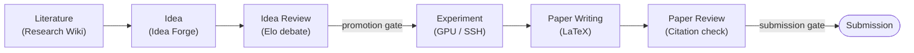

# Core Concepts

This document explains the ideas you need to use Polaris well: the six-stage research pipeline, the
Voyage long-running agent, the skill system, and the MCP tool layer. For how the system is built, see
[Architecture](architecture.md).

## The research pipeline

Polaris models research as six stages. Each stage produces durable artifacts that the next stage
consumes, and every hand-off can pause at a human approval gate.



### 1. Literature: the Research Wiki

The Research Wiki builds a persistent, cross-linked knowledge base instead of doing on-demand
retrieval at query time. Its motto is "compile, don't retrieve."

- **Sources.** OpenAlex (citation graph and bulk metadata, no key required), Semantic Scholar
  (semantic search and TLDRs, with server-side caching and a token bucket), and arXiv (latest
  preprints and PDFs).
- **Cold start.** Starting from anchor papers, it snowballs citations, scores each paper's relevance
  against a project-specific rubric derived from a structured interview, extracts full text with
  PyMuPDF, and compiles each paper into a wiki page (TL;DR, method, reusable ideas, and concept
  backlinks).
- **Incremental sync.** A daily ingest resumes from a watermark so it only processes what is new,
  with cost knobs (relevance threshold, top-N, model tier).
- **Search and export.** pgvector powers semantic search over papers and full-text chunks. The whole
  vault exports to Obsidian with `[[wikilinks]]` and frontmatter.

### 2. Idea: the Idea Forge

The Idea Forge turns the knowledge base into research directions.

- **Multi-signal gap analysis.** It looks for concept co-occurrence holes, mines limitations
  extracted from papers, measures trend velocity, and finds survey gaps.
- **Retrieval-planned generation.** Those signals drive idea generation that plans its own retrieval
  rather than dumping a fixed context into one prompt.
- **Scoring and dedup.** Ideas are scored on four axes (novelty, feasibility, operability, impact),
  deduplicated semantically, and funneled through a candidate pool.
- **Research Proposal builder.** A deep builder then hardens the winning idea with a plan-execute-verify
  loop, double-checking novelty against the local library and external sources.

### 3. Idea Review

Configurable-persona reviewer agents debate ideas pairwise, and a judge produces an Elo tournament
ranking. Lab members can join the discussion live over WebSocket, and their comments enter the agent
context as first-class input rather than being bolted on afterward. Promotion to the experiment stage
passes through a gate.

### 4. Experiment: the Experiment Lab

The Experiment Lab runs studies on the lab's real GPU servers using per-user, Fernet-encrypted SSH
credentials.

- An experiment Voyage plans the study (hypothesis, reproduction strategy, budget), passes a
  compute-budget gate, then writes code into a per-experiment working directory.
- It runs a smoke test (verified by Sextant), launches runs with streamed logs and live metric
  curves, then auto-iterates: parse metrics, reflect, then improve, debug, or stop.
- Figures are generated and checked by a vision-language model.
- Safety is enforced with gated remote writes, command allow/deny lists, a full audit trail, and
  triple budget caps (total, per-run, concurrency).

### 5. Paper Writing: the Paper Writer

The Paper Writer opens a multi-file LaTeX project (NeurIPS, ICLR, ACL templates) in a CodeMirror 6
editor with real-time collaborative editing (CRDT via Yjs) and server-side tectonic compilation to a
live PDF preview. An agent drafts section by section, but with hard constraints: experiment numbers
may only come from real `ExperimentRun` metrics, and citations must map to real knowledge-base
entries.

### 6. Paper Review

Paper Review runs line-by-line citation verification (existence: exact, minor, or fabricated; support:
supported, partial, or unsupported) plus deterministic fact-checking of every number against the
experiment record. Multi-perspective top-venue reviewer agents then produce reviews and a
meta-review. A fabricated citation forces a non-pass.

## The Voyage long-running agent

Research tasks are long-running by nature, so Polaris treats every complex task as a **Voyage**: a
resumable, auditable run driven by a persisted three-part loop. The naming follows a navigation
metaphor.

| Component | Role |
| --- | --- |
| **Navigator** | Planning. Decomposes a goal into a step plan with sub-goals, dependencies, and budget. In loop mode it edits the plan incrementally as evidence arrives, rather than replanning from scratch. |
| **Helm** | Execution. Runs a single step (LLM calls, tool calls, SSH remote ops, literature-API queries) and returns an observation. |
| **Sextant** | Self-verification. Checks each step against structured acceptance criteria (exit code, artifact exists, schema valid, metric threshold, count, LLM rubric). Deterministic checks run first; failures feed diagnostics back to Navigator, and repeated failure escalates to a human gate. |

### Persistent state machine

A Voyage moves through a persisted state machine:

```text
planning -> executing -> verifying -+-> executing (next step)
   ^            |                    +-> replanning -> planning
   |            v                    +-> paused_gate (human approval, resume on approval)
   +---- paused_error <--------------+
                                     +-> done / failed
```

Every run persists its goal, kind, plan, current step cursor, status, checkpoint, and budget/usage.
Every step persists its action, inputs, observation, and Sextant verdict (pass or fail with a
reason), along with token counts and timing. This buys four things:

1. **Resumability.** If a worker crashes mid-run, the Voyage resumes from its last checkpoint after a
   health check.
2. **Human-in-the-loop.** A step can declare that it needs a gate (compute budget, remote write,
   promotion); the state machine natively supports pausing and resuming on approval.
3. **Auditability.** Every plan, action, and verdict is retained and replayable in the UI.
4. **Cost control.** Budgets are attached to the run and auto-pause it when exceeded.

### Runtime shell vs. brain

Not every task needs the full cognitive loop. A shared runtime shell (state machine, checkpointing,
gates, budget, cancellation, event streaming) serves all task kinds, while the full plan-execute-verify
brain activates only for open-ended kinds such as experiments. Predictable pipelines (wiki compile,
idea review, paper drafting) run on fixed templates instead of being over-orchestrated.

## The skill system

Agent behavior is packaged as **data, not code**. The judgemental instructions that used to be
hard-coded in the Voyage actions (prompts, scoring rubrics, reviewer personas, writing conventions,
workflow templates) are extracted into versionable, composable "skills" that users can author, the
platform can ship as built-ins, and members can share through a marketplace.

There are four skill kinds:

| Kind | Effect |
| --- | --- |
| `guidance` | Appends domain instructions to a stage's system prompt (for example, an academic writing convention or an experiment code-style checklist). |
| `rubric` | Replaces or augments a stage's scoring rubric (for example, literature relevance criteria or a top-venue review rubric). |
| `persona` | Provides one or more reviewer/debater personas consumed by the idea-debate and paper-review stages. |
| `workflow` | A template of whitelisted steps (the same schema Navigator uses) that can seed a free-planning Voyage. |

Key properties:

- **No arbitrary code.** A v1 skill contains only declarative content (instruction markdown, rubric,
  personas, or a template of already-registered actions). Skills change only the judgemental behavior;
  they never bypass the LLM routing or the hard guardrails in code.
- **Injection points.** Skills attach at named points that correspond to a Voyage action and its
  internal LLM call (for example `forge.score`, `review.referees`, `writing.section`). A project
  enables skills against these points, and multiple skills at one point are concatenated in order.
- **Reproducible and auditable.** When a Voyage starts, it snapshots the skills in effect into the
  run, so a later replay shows exactly which skill versions were used. Editing a skill mid-run does
  not affect a run already in flight.
- **Marketplace.** Skills can be published (with admin approval), installed, rated, and exported or
  imported as single-file JSON packs for sharing across deployments.

## The MCP read-only tool layer

Polaris's retrieval capabilities (concepts, literature, knowledge, project state, external search)
are unified into a single registry of **read-only tools**. Tool definitions are the single source of
truth: each is registered once and reused by two consumers.

- **Internally**, the Voyage agent uses these tools during writing, review, idea building, and
  literature analysis so the LLM can retrieve on demand mid-generation instead of receiving one
  capped context up front.
- **Externally**, an MCP protocol server exposes the same tools to MCP clients such as Claude Desktop
  and Cursor.

The registry holds around two dozen tools spanning in-library search (papers, chunks, wiki,
concepts, figures, knowledge graph), project state (ideas, experiments, fact packs), and external
lookups (Semantic Scholar and OpenAlex search, references, citations, DOI lookup). Figure tools can
return inline images so external clients can pull method and experiment figures directly.

The external server offers two transports:

- **Streamable HTTP** at `POST /mcp`, authenticated with the platform JWT. Each tool call carries a
  `project_id`, and the server verifies the caller is a member of that project.
- **stdio** via `python -m app.mcp`, for local desktop clients, where the user is identified by an
  environment variable.

Everything here is strictly read-only and project-isolated: there are no write, delete, or SSH
operations exposed through the tool layer.
