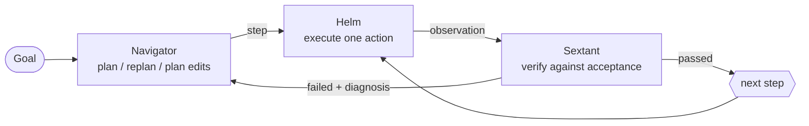
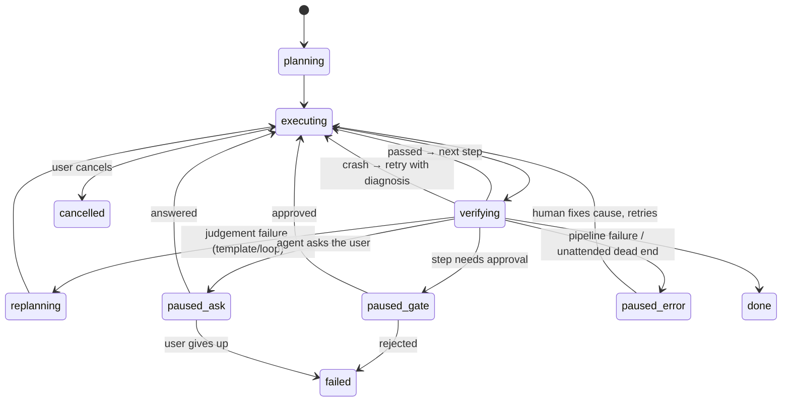

# The Voyage agent core

Research tasks are long-running by nature. A literature backfill takes hours; an experiment trains
for days; a paper draft is written section by section with a human looking over the agent's
shoulder. An agent built as "a loop over an LLM in one process" cannot survive that: the process
restarts, the context window fills, the human goes home, the GPU box drops the SSH connection.

Polaris's answer is its central abstraction: every complex task runs as a **Voyage** — a persisted,
resumable, auditable agent run backed by a state machine in Postgres. The UI calls these *Tasks*; the
code and this document call them voyages. This page explains the design. For the
implementation-level reference (tables, permissions, the action registry, worked examples), see
[The task system](task-system.md); for where the engine sits in the overall system, see
[Architecture](architecture.md).

## The Voyage long-running agent

The design starts from one observation: **everything the agent needs to continue must live outside
the process**. So a voyage persists its goal, its plan, the current step, every observation and
verdict, its token usage, and a checkpoint of working state. The process driving it — an ARQ worker
job — is disposable. Kill it at any point and another worker picks the run up where it stopped.

That persistence buys the four properties research automation actually needs:

1. **Resumability.** A crashed worker, a dropped SSH connection, a stuck LLM call — the run resumes
   from its last committed state instead of starting over.
2. **Human-in-the-loop.** The state machine has first-class paused states: waiting for an approval,
   waiting for an answer to a question the agent asked. Pausing costs nothing; a run can wait for
   days.
3. **Auditability.** Every plan revision, every attempt, every verdict is retained and replayable in
   the UI. Streamed output is ephemeral; anything that matters is written down.
4. **Cost control.** Budgets attach to the run, and the engine checks them between steps.

### Shell and brain

Not every task needs a clever agent. A shared **runtime shell** — the state machine, checkpointing,
gates, budgets, cancellation, event streaming — serves every task kind. The full
plan-execute-verify **brain** engages only where the work is genuinely open-ended. That split shows
up as three run modes, derived from the task's kind:

| Mode | Used for | Failure behavior |
| --- | --- | --- |
| `pipeline` | Predictable fixed sequences: literature ingest, daily feed, idea forge, idea review, paper drafting, paper review, slides | No LLM replanning. A failed step pauses the run for a human to fix and resume. The plan can still grow at runtime, but only through deterministic branch tables. |
| `template` | Semi-structured work: the research proposal builder | A deterministic branch table handles known failure classes (e.g. a duplicate-novelty verdict reruns from the design step); the LLM replans only as a fallback. |
| `loop` | Open-ended work: experiments, user-defined workflow skills | The Navigator edits the plan incrementally as evidence arrives. |

Over-orchestrating a predictable pipeline wastes tokens and adds failure modes; under-orchestrating
an experiment produces an agent that cannot recover. The mode is recomputed from the kind on every
drive, so it is a property of the work, not a knob anyone sets.

## Navigator, Helm, Sextant

The brain is split into three components with deliberately narrow contracts, named after ship
navigation.

```mermaid
flowchart LR
    G([Goal]) --> N
    N["Navigator\nplan / replan / plan edits"] -->|step| H["Helm\nexecute one action"]
    H -->|observation| S["Sextant\nverify against acceptance"]
    S -->|passed| N2{{next step}}
    S -->|failed + diagnosis| N
    N2 --> H
```

### Navigator — planning

Navigator turns a goal into a **step plan**: an ordered list of steps, each with a title, an action
from the registry, parameters, an acceptance declaration (a human-readable criterion plus structured
checks), an optional approval gate, and an optional per-step attempt budget. Ordering doubles as
dependency: steps are scheduled by rank, and gap-numbered ranks let new steps slot in between
existing ones without renumbering anything.

Today every built-in kind uses a **fixed plan template** — seven steps for a wiki ingest, eight or
nine for a proposal, three fixed steps plus round one for an experiment. The free-planning path
(LLM writes the plan, constrained to registered actions and validated strictly) is live code, but
nothing ships on it yet; `custom` tasks get their plan from a
[workflow skill](skills.md#task-skills) instead.

Where Navigator earns its keep is **failure**. In loop mode it does not replan from scratch: it emits
an incremental *plan edit* — `add_nodes` / `update_node` / `obsolete_nodes` — validated against hard
invariants: at most 8 new steps per edit, only unfinished steps may be touched, passed steps can be
neither edited nor obsoleted, nothing may be inserted before the current execution point, and
superseded steps are marked obsolete rather than deleted, so the history stays intact. If the model
answers "finish" or produces nothing usable, the run pauses — no progress is never allowed to look
like success.

Some plan growth needs no LLM at all: a step can return a `plan_signal`, and a deterministic branch
table per kind expands it (an idea-review pairing step fans out into N debate steps; an experiment
analysis step appends the next round). These tables are idempotent, which is why they are allowed
even in pipeline mode.

### Helm — execution

Helm is deliberately tiny: look up the step's action in the registry, call it, and **never let an
exception escape** — an unknown action or a raised error becomes `{"error": …}` in the observation,
so the state machine stays in control no matter what the action does. Actions do the real work: LLM
calls, literature API queries, SSH commands on GPU servers, LaTeX compiles. Long-form LLM output is
streamed token by token to the run's live terminal while the step executes.

### Sextant — verification

Sextant answers one question after every step: *did this actually work?* Its check chain is ordered
by cost, and the cheap end always runs first:

1. `observation.error` set ⇒ fail, no further evaluation.
2. The action supplied its own machine verdict (`self_check`) ⇒ trust it.
3. The step declares structured `checks` ⇒ run them: **deterministic checks first, short-circuiting
   on the first failure — no LLM call is made**; only if all pass and an `llm_rubric` remains does a
   model get involved.
4. Legacy fallback for steps with no `checks`: a deterministic action allowlist, then the skill's
   output contract, then the free-text acceptance criterion judged by an LLM.

The check registry (`app/agents/voyage/checks.py`):

| Check | Passes when | Cost |
| --- | --- | --- |
| `no_error` | The observation has no `error` key. | free |
| `exit_code` | `observation.exit_code` equals the expected value (default 0). | free |
| `artifact_exists` | A dotted path resolves to something non-empty in the run's checkpoint. | free |
| `schema_valid` | A named field is an object containing every required key. | free |
| `metric` | `observation.metrics[name]` satisfies `op value` (`>=`, `<=`, `>`, `<`, `==`). | free |
| `min_count` | A field counts at least N (length, or the number itself). | free |
| `llm_rubric` | An LLM, shown the output and the rubric, answers yes. | one model call |

Failure reasons are deliberately specific — `[metric] accuracy = 0.62, does not satisfy >= 0.8` —
because that string becomes the diagnosis injected into the retry parameters and the replanning
prompt. A vague verdict makes the retry useless.

A run can also declare **done criteria** in the same check format, evaluated once when all steps have
finished. If they fail, the run does not quietly declare victory: it asks the user whether to accept
the result, keep going, or stop.

## The persisted state machine

```mermaid
stateDiagram-v2
    [*] --> planning
    planning --> executing
    executing --> verifying
    verifying --> executing : passed → next step
    verifying --> executing : crash → retry with diagnosis
    verifying --> replanning : judgement failure (template/loop)
    replanning --> executing
    verifying --> paused_gate : step needs approval
    paused_gate --> executing : approved
    verifying --> paused_ask : agent asks the user
    paused_ask --> executing : answered
    verifying --> paused_error : pipeline failure / unattended dead end
    paused_error --> executing : human fixes cause, retries
    verifying --> done
    paused_gate --> failed : rejected
    paused_ask --> failed : user gives up
    executing --> cancelled : user cancels
```

Every state transition is a committed row update, so the diagram is not documentation of intent — it
*is* the run's stored status. Three details matter in practice:

- **Crash vs. judgement.** A step that blew up (`observation.error`) is retried in place with the
  failure reason injected as a diagnosis, within its attempt budget. A step that ran fine but failed
  its acceptance check is never blindly retried — rerunning identical work cannot change a
  judgement — and goes to the mode-specific branch instead.
- **Cancellation is cooperative but airtight.** Cancel writes `cancelled`; the engine re-reads the
  status before every step, and every status write is a conditional update that refuses to overwrite
  `cancelled` — an in-flight engine can never resurrect a cancelled run.
- **`failed` is a human verdict.** The engine on its own only pauses. A run reaches `failed` through
  a person: cancelling, rejecting a gate, or answering "give up" to a question. (Unattended
  cron-started runs, which have nobody to ask, keep the older degrade-to-`paused_error` semantics.)

Everything about a run lives in three tables — the run row (goal, kind, plan snapshot, status,
checkpoint, budget, usage), one row per step (action, params, observation, verdict, full archive of
every attempt), and the persisted terminal log. The **checkpoint** is the run's working memory: a
JSON column the engine hands to each action and commits back after, so step 5 can read what step 2
wrote, and a resumed run sees exactly what the last commit saw. The full column-by-column reference
is in [The task system](task-system.md#1-what-a-task-is).

## Approval gates

Some transitions should never be automatic: promoting an idea into a funded experiment, spending
compute, writing to a lab GPU server, submitting a paper. These are **gates** — pending approval
records tied to the topic. The four platform-level kinds:

| Gate kind | Guards |
| --- | --- |
| `idea_promotion` | Promoting an idea to the experiment stage. |
| `compute_budget` | Spending GPU time — created before an experiment's environment setup. |
| `remote_write` | Writing files or running state-changing commands on a remote server. |
| `paper_submission` | Marking a manuscript as submitted. Approval requires the manuscript to have passed [paper review](paper-review.md) first, unless an admin explicitly overrides. |

A step that declares `requires_gate` stops the run before executing: the engine creates the gate,
sets the run to `paused_gate`, and **ends its worker job** — a paused voyage consumes nothing while
it waits. Topic members see the pending gate in the workspace and get a WebSocket notification.
Approving enqueues a resume and the run continues from exactly that step; rejecting sets the run to
`failed`. Gate decisions also carry domain side effects — approving `idea_promotion` flips the idea's
status, approving `paper_submission` marks the manuscript submitted.

One smaller point: a gate's kind is simply whatever the step declared, so flows can define their
own intermediate approvals through the same mechanism — the proposal builder does this with
`idea_goal` (confirm the research goal) and `idea_pivot` (approve a direction change).

## Mid-run questions: `paused_ask`

Gates are the platform asking "may I?". Sometimes the agent instead needs to ask "what should I
do?" — a step failed in a way where blind retries would burn GPU hours, or two plan edits in a row
changed nothing. Rather than dying with `paused_error`, the engine posts a **question into the run's
message stream** and parks the run in `paused_ask`.

Each question carries quick-choice options suited to the situation — retry this step (with
instructions), change approach (describe how), continue, wrap up with current results, add budget,
give up — and free-text answers are always allowed. The console shows "The AI is waiting for your
reply". Answering resumes the run with your instruction injected into the retry or replanning
context; choosing to give up is the one path that ends the run as `failed`. Duplicate answers (two
people replying at once) are rejected by a conditional update, so a question is consumed exactly
once.

The message stream is two-way even when nothing is blocked: you can post a **suggestion at any
time** while a run executes. Suggestions queue without interrupting anything and are consumed at the
agent's next decision point — the console confirms with "Sent — the AI will factor it in at its next
decision". Consumption commits in the same transaction as the decision it influenced, so a resumed
replay never double-applies your advice.

<!-- screenshot: a task console in paused_ask state, showing the agent's question with quick-choice buttons and the reply composer -->

## Budgets: time-boxed repair, not retry counting

Budgets exist at several levels, and the design principle is that **limits should be spent on
progress, not on attempts**:

- **Run token budget** (`budget.max_tokens`). Checked between steps. When it runs out, the engine
  does not just stop: steps flagged as wrap-up (a final report, a tournament summary, the last
  compile) are still allowed to run while everything else pending is marked obsolete — hours of
  completed work become a deliverable instead of being lost on the final cheap step. Only when
  nothing has completed at all does the run pause. Library tasks additionally fold a monthly
  per-library budget into the same mechanism: a spent month refuses to start a run at all.
- **Time-boxed repair loops.** Inside an experiment, the debug/fix cycle has no retry counter. It
  runs under a wall-clock phase budget (`budget.max_hours`), because "three strikes" is the wrong
  model for repair: three attempts might be three seconds of syntax fixes or three hours of
  training. The clock, not an attempt count, is the brake — and the clock excludes time spent
  queued, gated, or waiting for an answer.
- **Signature-aware replan limits.** Plan edits are capped at 2 consecutive attempts *per error
  signature*. If an edit changes the error, that is progress and the counter resets; if the same
  signature comes back, the next prompt carries a zero-progress warning demanding a fundamentally
  different approach, and after the cap the engine asks the user instead of looping.
- **Per-step attempt budgets** (`budget.max_attempts`) govern only crash retries — 1 attempt by
  default in pipelines (whose steps have side effects), 2 in template/loop.

## Crash recovery

The engine assumes it will be killed and designs backwards from that:

- **Startup reconcile.** When the worker boots, every run still marked as in-flight (statuses that
  mean "a worker should be driving this" — the paused states are excluded, since they wait for
  humans, not workers) is re-enqueued for resume, with time-bucketed deduplication so restarts do
  not double-drive a run.
- **Stale-run sweep.** A cron periodically reclaims in-flight runs whose terminal has been silent
  too long — the net under jobs lost mid-run (an LLM call that hung until the job was killed, ARQ's
  exponential backoff leaving a run orphaned for hours). Live long steps keep producing log lines,
  so brief silence is never misread as death.
- **Resume semantics.** Resuming resets failed and running steps back to pending with a fresh
  attempt counter (their history is already archived per attempt) and drives on. Passed steps are
  never redone: fix the cause, press retry, and the run picks up at the broken step with the crawl,
  the scoring, the training rounds it already paid for intact.
- **Remote process reattach.** Experiment work runs detached on the GPU server (`nohup`, with the
  pid, log, and exit code persisted on the remote filesystem). A resumed or reconnected run
  **re-attaches to the process that is still running** instead of launching a second one, and
  transient SSH drops during polling reconnect with backoff rather than failing the experiment. A
  training job survives the platform restarting under it.

All of this is safe because the engine is idempotent: steps carry their own status, the checkpoint
carries the data, and the deterministic branch tables do not duplicate steps on replay.

## File-based agent memory

Long loop-mode runs outlive any context window, so the experiment agent keeps its memory **as a
file**: `MEMORY.md` in the experiment's working directory, mirrored into the run checkpoint (the
mirror is the source of truth; the engine persists it every step, so it survives server disconnects).

The agent appends timestamped entries at its own decision points — "direction X is falsified:
reason" — and the platform appends structural events. Every experiment-side LLM decision gets the
tail of the memory injected (a budget of the newest few thousand characters; the full file rolls off
oldest-first at 40 k). Because it is a plain markdown file in the workdir, the human can read it live
in the console's code view, the experiment scripts can read it, and the wrap-up report is written
from distilled memory rather than from replaying weeks of raw logs.

## Observability

A voyage is watchable at three zoom levels:

- **The live event stream.** Everything the engine does is published to a per-run Redis channel and
  forwarded as SSE: status changes, full step snapshots, structured log lines, and token-by-token
  LLM output. The stream replays the current status on connect and closes itself after a terminal
  status.
- **The persisted terminal.** Log lines and complete model outputs are also written to the database
  (high-frequency token deltas deliberately are not), so a page refresh reconstructs the terminal
  from history. Rows are kept for 30 days.
- **The run console.** The task detail page combines the plan with per-step status, timing, tokens
  and verdicts; the terminal; the two-way message stream with its composer; `plan_history` — every
  plan change with its source (signal, navigator, template, budget) and reason in plain language;
  and the snapshot of which [skill](skills.md) versions the run used.

Run status changes and new gates are additionally pushed to the topic's notification channel, so a
paused run does not wait unnoticed.

<!-- screenshot: the task detail page: step list with verdicts on the left, live terminal on the right, message composer below -->

## Where to go next

- [The task system](task-system.md) — the implementation-level reference: data model, kind
  catalogue, permissions, the action registry, checkpoints, and two worked end-to-end examples.
- [Experiments](experiments.md) — the loop-mode voyage in full: intake, compute gates, smoke tests,
  metric-driven iteration.
- [Skills](skills.md) — how skill snapshots feed voyage prompts, and workflow skills as custom plans.
- [PolarisBuddy](buddy.md) — the same Navigator / Helm / Sextant split, scaled down to a
  conversation.
- [Architecture](architecture.md) — where the engine, worker, and event bus sit in the system.
