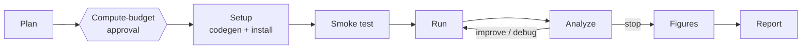

# Experiments

The Experiment Lab turns a promoted idea into a real experiment on your lab's GPU servers. An
experiment is a long-running [task](task-system.md) (kind `experiment`) that plans the study, writes
the code, verifies it, runs it over SSH, iterates on the metrics, and ends with figures and a written
report — pausing for your approval before it spends compute, and pausing to ask you a question
whenever it is genuinely stuck.

The page lives in the topic workspace under **Experiment Lab**.

## How it works

### Prerequisites

- **A promoted idea.** Experiments are created from ideas with status `promoted` — promote one in
  Idea Review first (see [Ideas](ideas.md)). The idea (and, for deep-dive ideas, its full Research
  Proposal — objectives, success criteria, planned conditions) becomes the input to study planning.
- **An SSH credential.** Add one under **Settings → SSH credentials**: host, port, username, private
  key, and an optional passphrase. Credentials are **per user** — an experiment always runs under a
  credential you own. The private key and passphrase are encrypted at rest with Fernet and are never
  returned by any API. Each experiment gets an isolated working directory
  `~/polaris_runs/<experiment-id>` on the target server.

<!-- screenshot: Settings page, SSH credentials section with one credential added -->

::: tip Safety model
The LLM never composes shell commands. It only produces file contents; every remote command comes
from a fixed whitelist of templates, the working directory is confined to
`~/polaris_runs/<experiment-id>`, and every remote command is written to the audit log.
:::

### The pipeline

1. **Plan.** The AI drafts a structured plan from the idea, its Research Proposal, and excerpts of
   the most relevant wiki pages in your topic's libraries: 1–5 testable hypotheses, a reproduction
   strategy, steps, a **primary metric** with a direction (maximize/minimize), and — for comparative
   studies — conditions (exactly one baseline plus treatments), an evaluation protocol, datasets, and
   models. It also classifies the experiment (`eval`, `training`, `agent`, `analysis`, `other`) and
   may declare a preset container image for heavy frameworks; otherwise the run uses a bare-metal
   virtualenv.
2. **Compute-budget gate.** Before anything touches the cluster, the task pauses at a
   `compute_budget` approval carrying the plan summary and the estimated GPU hours. Approve it under
   **Approvals** (or from the experiment page banner, "Open approvals"). Rejecting the gate marks the
   experiment failed.
3. **Setup.** The AI generates the code as a set of files — `requirements.txt`, a `run.sh` that must
   support `--smoke`, and Python sources. Every generated `.py` file is compiled locally with
   `ast.parse` **before it is sent anywhere**: a syntax error is bounced straight back to the model
   with the offending line, instead of being discovered by a failed run on the cluster. File paths
   are validated too (no absolute paths, no `..`). The platform then creates the workdir, writes its
   own `env.sh` (workdir, model/dataset roots, pip mirror, HF endpoint, proxy — see settings below)
   and, if you set an eval model, an `llm_config.json` the code must read instead of hard-coding
   keys. A **resource preflight** probes GPUs and every locally-referenced model or dataset path; a
   missing local model asks you for the correct path rather than failing later. Dependency
   installation runs detached on the server and self-heals: install failures go back to the model to
   fix `requirements.txt`/`run.sh`, without a fixed retry cap.
4. **Smoke test.** `run.sh --smoke` must exit 0 on a tiny sample (10-minute cap). Failures are
   diagnosed (missing dependency, wrong local model path, OOM, network) and fed back to the model
   for a full-file fix. If `requirements.txt` changed, dependencies are actually reinstalled before
   the next attempt.
5. **Run.** The real run is launched detached (`nohup`) and polled every 30 seconds. Log output
   streams into the console and is mirrored to a server-side local file; any
   `POLARIS_METRIC {"name": ..., "step": ..., "value": ...}` line — and an optional
   `metrics.json` — is parsed deterministically into live metric curves. A run that exceeds the
   per-run time budget is killed automatically.
6. **Analyze.** After each run the AI writes a structured reflection: what happened, a diagnosis,
   per-hypothesis updates (`verified` / `falsified` / `testing`), and a decision — **improve**,
   **debug**, **stop**, or **ask** you a question. `improve` proposals see the *full archive* of
   prior attempts (source, score, and trace of every run, with the best and most recent in full), so
   iteration builds on everything tried, not just the last round. After repeated rounds without
   metric gain the model is explicitly pushed to change approach rather than keep tuning.
7. **Figures.** The platform writes all parsed metrics to `metrics_all.json`; the AI writes a
   `plot_figures.py` that is only allowed to read that file (hard-coded data points are rejected).
   The resulting PNGs (plus paper-ready PDFs) are pulled back and **checked by a vision model** for
   readable axes, legends, and non-empty content, with captions attached; a failing check regenerates
   the script up to twice, then the pipeline continues with whatever it has.
8. **Report.** A markdown report is generated from the plan, per-round history, metric data, the
   comparison summary (baseline vs. treatments, computed deterministically), and log tails: results
   overview, metric behaviour, a verdict per hypothesis, limitations and next steps. It appears on
   the **Report** tab and later feeds [paper writing](writing.md) as part of the fact pack.

### When iteration stops

Auto-iteration ends when the AI decides `stop`, when every hypothesis is resolved, after
`no_improve_stop` consecutive runs without primary-metric improvement (default 2), or when the
`max_runs` / `max_hours` budget is hit. Repair loops (setup, smoke, debug) have **no fixed retry
count** — they are braked only by the time budget and by zero-progress detection: if the exact same
error signature repeats, the model is first forced to change strategy, and after four identical
failures the task stops fixing and asks you instead.

### Agent memory

Every experiment keeps a file-based memory: `MEMORY.md` in the workdir, mirrored into the task
checkpoint so it survives disconnects. The platform writes key events deterministically (plan
decisions, environment facts, per-round conclusions, exhausted repair budgets, your decisions), and
the AI adds its own notes via reflection. The tail of this memory is injected into **every**
LLM decision point, so conclusions from round 2 are still known in round 9. You can read it live on
the **Memory** tab, and experiment scripts can read the file directly.

## Step-by-step usage

1. Open **Experiment Lab** in your topic and click **New experiment**.
2. Pick a **promoted idea** and one of your **SSH credentials**.
3. Set the budget:
   - **Time budget (hours)** — empty means unlimited. This is the only brake on auto-fixing: on
     timeout the task pauses and asks you what to do.
   - **Max runs** — cap on iteration rounds (default 10).
   - **Auto stop** — fixed: wraps up after 2 runs in a row without metric gain.
4. Answer the **intake questions**. The AI prepares a few questions specific to the idea ("The AI
   wants to confirm a few things first") — datasets, model sizes, scope. Answering is optional; you
   can also chat during the run. Answers are injected into planning and code generation.
5. Click **Create experiment**. The task queues, plans, and pauses at the compute-budget approval —
   approve it and the run proceeds on its own.
6. Watch it on the detail page tabs: **Console**, **Plan**, **Metrics & runs**, **Memory**, **Code**,
   **Report**.

<!-- screenshot: New experiment modal with idea, SSH credential, budget fields, and AI intake questions -->

### The run console

The **Console** tab is where you live during a run:

- **Task map** — every step of the run as a graph: done, running, pending, awaiting approval, or
  waiting for you. Click a node for the step detail (params, observation, verification verdict);
  toggle "Show obsolete steps" to see superseded plan branches.
- **Terminal** — the live transcript, with two views: **AI process** (planning, fixes, decisions,
  verification) and **Script output** (your experiment's stdout/stderr, streamed from the server).
- **Composer** — a message box under the terminal. This is not decoration: anything you type is
  queued as guidance and injected at the AI's **next decision point**, including mid-stream inside a
  long dependency-install or smoke-fix loop ("Sent — the AI will factor it in at its next
  decision"). If you watch it fight the wrong library, say so — it will read you.
- **Server status** — host, workdir, GPU probe results.

<!-- screenshot: Console tab with the task map on the left and the terminal plus composer on the right -->

### Mid-run questions (paused_ask)

When the AI hits a dead end — install loop with zero progress, out-of-time smoke fixes, a missing
local model, or an ambiguous result — it does not fail the experiment. It pauses the task
(`paused_ask`), the experiment shows **waiting for you**, and an **AI question** block appears in
the console with concrete options, typically:

- **Retry with instructions** — tell it what to change (different package, smaller model, other
  mirror); your text is injected as guidance and the step re-runs.
- **Change approach (describe how)** — triggers a plan adjustment along your description.
- **Give up** — the only way (besides a rejected gate) an experiment is ever marked `failed`.
  Terminal failure is always a human decision.

Reply in the composer ("Type your reply — or just pick an option above"). The task resumes
immediately after your answer. Pending questions also surface in notifications, so you do not need
to keep the tab open.

<!-- screenshot: AI question block in the console with options and the reply box below -->

## Key settings

**Experiment settings** (admin, under **Settings**) apply platform-wide and are exported into every
run's `env.sh` — and, as importantly, stated as facts in the code-generation prompt so the model
does not guess machine-specific paths:

| Setting | Meaning |
| --- | --- |
| `model_root` | Where local model checkpoints live on the servers (e.g. `~/hf/model`); exported as `POLARIS_MODEL_ROOT` |
| `dataset_root` | Local dataset root; exported as `POLARIS_DATASET_ROOT` |
| `pip_index_url` | pip mirror used for all installs |
| `hf_endpoint` | HuggingFace mirror endpoint (overrides the per-experiment HF-mirror toggle) |
| `proxy_url` | Outbound HTTP proxy for the experiment machines (a per-credential proxy takes precedence) |

All values are validated against strict whitelists before they are accepted — they end up in a
remote shell `export`, so malformed values are rejected outright.

Per-experiment options on creation: **GPU hint**, **eval model** (an LLM the experiment code may
call through `llm_config.json`), **HF mirror** toggle, and free-form **extra notes** the model must
follow.

## Crash recovery and resume

Experiments are built to survive infrastructure trouble; from your point of view:

- **Backend restarts don't lose runs.** All state (plan, checkpoint, code files, metrics, memory) is
  persisted per step. A worker cron reconciles in-flight tasks every 10 minutes and re-queues any
  run whose worker died mid-step.
- **Remote processes are reattached, not restarted.** Training and install processes run detached
  under `nohup`, with their exit code and log persisted on the server. After a restart the poller
  finds the previous round still marked running and **re-attaches to the same PID** — it does not
  launch a duplicate. If the process already finished, the persisted exit code is picked up; if it
  died, the round is handed to analysis for a debug decision.
- **SSH blips are absorbed.** Transient disconnects during polling reconnect with exponential
  backoff; only after six consecutive reconnect failures does the step give up (and even that is a
  recoverable step failure, not a dead experiment).
- **Manual retry.** If a task ends up paused on an error, the console offers a retry that re-queues
  it "resuming from where it stopped" — completed steps are never redone; code already generated is
  not regenerated.

## Tips and limits

- **Cancel is cooperative.** Cancelling an experiment marks the task cancelled, sets running rounds
  failed, and makes a best-effort SSH kill of the remote processes. Moving a running experiment to
  the trash cancels it first.
- **Metrics must be printed.** Only `POLARIS_METRIC` lines (and an optional `metrics.json`) become
  curves; the generated code is instructed to print them, but if you hand-edit code on the Code tab,
  keep the convention. Non-finite values (NaN/Inf) are silently dropped rather than poisoning the
  run record.
- **Comparative experiments** log the metric per condition (`accuracy/<model>/<condition>`); the
  platform computes per-condition means and deltas vs. baseline deterministically and feeds them to
  analysis and the report.
- **The remote workdir is never auto-deleted.** Purging an experiment deletes local logs and figures;
  `~/polaris_runs/<id>` on the shared server is left for you to clean.
- **Budgets are hard.** A round that exceeds the time budget is killed, not nursed along; a plan that
  would exceed `max_runs` simply wraps up with what it has.
- Experiment numbers and figures flow into the [Paper Writer](writing.md) fact pack, and every number
  in the final paper is checked against this experiment record during [paper review](paper-review.md).
