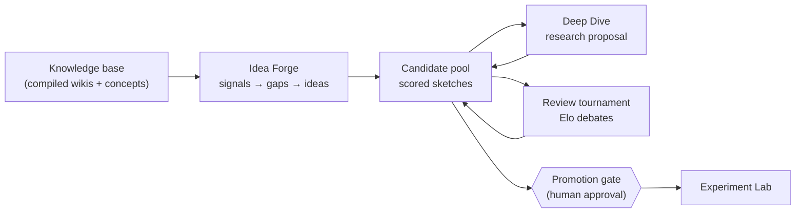

# Ideas & idea review

This page covers stages 01 and 02 of the research pipeline: **Idea Forge** (generating research
ideas from your knowledge base), the **Deep Dive** proposal builder (hardening one idea into a full
research proposal), and **Idea Review** (persona reviewer agents debating ideas into an Elo
ranking). It ends at the promotion gate — the human approval that lets an idea move on to the
[Experiment Lab](experiments.md).

Everything here runs on the [task system](task-system.md): each generation, deep dive, or
tournament is a long-running, resumable task with a live progress view, a step plan, and a budget.

## What it is

The literature stage leaves you with a library of compiled wiki pages and a concept graph (see
[Literature](literature.md)). The idea stage turns that knowledge base into research directions:

- **Idea Forge** analyzes the library for gaps — signals a human reader would collect by hand — and
  generates candidate ideas bound to those gaps, each scored on four axes and deduplicated against
  the existing pool.
- **Deep Dive** takes one seed (free text, a concept, a paper, or an existing sketch) and produces a
  full research proposal through a plan–execute–verify loop, with a novelty check against the
  library and external sources and an internal review-and-revise pass.
- **Idea Review** runs a debate tournament: AI reviewer personas argue pairs of ideas pro and con, a
  judge picks winners, and Elo ratings accumulate into a leaderboard. Lab members comment live, and
  their comments become context for the next debates.

Ideas live in a per-topic **candidate pool** and move through a selection funnel:
`candidate → under review → promoted` (or `rejected`). Each idea also has a **depth** — `sketch`
(a Forge-generated outline) or `proposal` (a Deep Dive result) — and a research type
(method / benchmark / analysis / survey / application / theory).

## How Idea Forge works

A Forge run is a fixed seven-step task: read context, collect signals, synthesize gaps, generate,
score, deduplicate, persist. There is no human gate inside it — you launch it and get a batch of
scored candidates.

### Knowledge-base context

The run reads the topic's source libraries: compiled wiki pages (ordered by relevance score) up to
the **Context papers** knob, plus up to 100 concept names. This digest — direction statement,
concepts, wiki excerpts — is the raw material for everything that follows. A topic with no compiled
papers gives the Forge nothing to work with, so build the library first.

### Four gap signals

The Forge collects four kinds of evidence that a research gap exists. Two are pure computation over
the concept graph, two involve an LLM:

| Signal | What it finds | How |
| --- | --- | --- |
| **Concept co-occurrence holes** | Method × problem pairs that never appear together | Deterministic: the top method-side concepts crossed with the top problem-side concepts, keeping pairs with zero shared papers (top 5) |
| **Trend velocity** | Concepts gaining papers recently | Deterministic: concepts on papers added in the last 90 days, kept only with ≥ 2 recent papers (top 5) |
| **Paper limitations** | Gaps the authors themselves admit | Hybrid: paragraphs containing "limitation" / "future work" (and Chinese equivalents) are extracted from the top relevant full texts, then one LLM call condenses them into 2–4 gaps |
| **Survey gaps** | Under-explored areas visible from the corpus as a whole | LLM: reads the knowledge-base digest and proposes 3–6 gaps |

All four signals always run when you launch from the UI. A signal that fails (or finds nothing) is
skipped rather than failing the run; only a run where *every* signal comes back empty aborts.

### Generation, scoring, dedup

- **Gap-bound generation.** Every candidate idea must cite the gap it addresses (`gap_index`), and
  the prompt spreads ideas across different gaps and signals. The bound gap is stored on the idea as
  a **Signal** evidence entry, so you can always see *why* the Forge thought this idea was worth
  proposing. Each idea carries a title, summary, and a body with motivation, method sketch, expected
  experiments, and risks.
- **Four-axis scoring.** One LLM call per idea scores **novelty, feasibility, operability, impact**
  on 0–10, each with a written rationale. The composite shown in the UI is the plain average of the
  four. A failed scoring call keeps the idea, just unscored.
- **Semantic dedup.** Candidates are embedded and compared against each other and against every
  non-rejected idea already in the pool. Cosine similarity above the **Dedup threshold** (default
  0.85) flags a duplicate; a reranker double-checks the flag before the candidate is dropped. If no
  embedding model is configured, dedup is skipped and everything passes.

Survivors land in the pool as `candidate` sketches, with the context papers recorded as source
papers.

## Running Idea Forge

1. Open your topic and go to **Idea Forge** (stage 01 in the pipeline nav).
2. Click **Run Idea Forge**. The dialog has three knobs (below); defaults are sensible.
3. Confirm with **Start generating**. The run opens as a task page where you can watch each step —
   signal collection, gap synthesis, generation, scoring, dedup — with its observations.
4. When it finishes, the **Candidate pool** fills with scored sketch cards: four score rings, an Elo
   number, a depth badge, and a research-type badge. The **Selection funnel** card at the top counts
   ideas per stage (`candidate → in review → promoted`).
5. Open any card for the **Idea detail** page: full body, score rationales, evidence papers (tagged
   **Library** / **External** / **Signal**), source papers, and a per-idea **Discussion** panel.

<!-- screenshot: the Idea Forge page with the selection funnel card, filters, and a grid of scored candidate cards -->

Ideas you don't want are removed with **Reject** (keeps them in the pool, excluded from future
tournaments) or moved to the **Trash** tab (restorable; emptying the trash is permanent). Trash and
batch operations require the topic owner or an admin.

::: tip One idea task at a time
A topic runs at most one Forge / Deep Dive / tournament task at a time. Starting a second one while
another runs is refused with a clear message — wait for the running task or open it from the banner.
:::

## Deep Dive: the research proposal builder

A sketch is a direction, not a plan. **Deep Dive** (the second button on the Forge page) produces a
`proposal`-depth idea: a structured research goal plus a full proposal document, built by a
plan–execute–verify task that is allowed to search the literature as it works.

### Seeds and flow

The drawer accepts four seed types: **Free text**, **Concept**, **Paper**, or **From sketch** (the
same drawer opens from a sketch card's **Deepen into proposal** button; the proposal inherits the
sketch's evidence papers). The task then:

1. **Builds the research goal** by exploring the library with retrieval tools — research type, task,
   core question, objectives, scope, success criteria, key concepts, grounding papers, and a
   resource estimate (compute, data, weeks).
2. **Pauses for your confirmation** (if **Confirm the research goal first** is on, the default): a
   *Research goal confirmation* approval appears; your comment, if any, is merged into the goal
   before drafting continues.
3. **Drafts the proposal section by section**: related work, method design (following a template for
   the goal's research type), experiment and evaluation plan (which must include a minimal smoke-test
   experiment with steps and a metric), risks with mitigations.
4. **Checks novelty**: the top similar papers in the library (vector search) plus, when **External
   similarity search** is on, Semantic Scholar and OpenAlex. The verdict is `novel`,
   `needs_differentiation` (redesign with an explicit differentiation argument), or `duplicate` —
   a duplicate pauses at a *Direction change confirmation* approval where you decide whether the AI
   pivots or the run stops.
5. **Reviews and revises its own draft**: four dedicated reviewer agents — one per score axis
   (novelty, methodology/operability, feasibility, impact) — score the proposal 0–10 and list
   must-fix issues; the author agent revises the named sections and the panel re-reviews, up to
   **Review & revise rounds** times. Final scores and rationales are written to the idea, and the
   whole exchange is kept as a read-only **Review & revision history** on the idea detail page.

### What "verify" means here

Every step returns a machine-checkable self-check rather than trusting the model's word: the goal
must ground itself in real library papers (each with a stated reason), the related-work section must
cite every grounding paper, the experiment plan must contain a smoke test, the risks section needs
at least two risks each with a mitigation. A step that fails its check is retried or replanned; a
novelty failure replans deterministically (pivot the goal, then redo the design) instead of pushing
ahead.

The finished proposal document contains, in order: research goal, background and related work,
method design, experiment and evaluation plan (with the smoke test), expected outcomes, risks and
fallbacks, the novelty check with per-work differentiation, and any leftover must-fix issues from
the final review round. `[[paper:...]]` references in the text render as links into your library.

<!-- screenshot: the idea detail page of a proposal — research goal card, smoke test, four score bars with rationale, evidence papers -->

## Idea review: the debate tournament

Scores from the Forge are one model's opinion. The **Idea Review** page (stage 02) ranks ideas by
making them compete.

### How a tournament runs

1. Click **Run tournament**. Set **Debate rounds** (1–5, default 2) and edit the three **Reviewer
   personas** — each is a name plus a stance, e.g. a methodology hawk, a trends-and-impact
   evaluator, a pragmatic engineer. The first two personas argue **pro** and **con**; the third acts
   as the judge. Persona-type [skills](skills.md) attached to the review injection point can supply
   personas as well.
2. All non-rejected `candidate` and `under review` ideas enter (you need at least two). Entrants are
   flipped to `under review`.
3. **Pairing** is Swiss-style: ideas are sorted by Elo and paired with their neighbors, proposals
   paired with proposals and sketches with sketches. An odd idea sits the round out with a bye. Each
   tournament run is a single round of matches — run it again as the pool evolves to sharpen the
   ranking.
4. Each match is a structured debate: per round, pro speaks then con speaks; after all rounds the
   judge declares a winner with a reason. **Human comments from each idea's Discussion panel are
   injected into the debate context**, so what the lab said about an idea is in front of the
   reviewers arguing it.
5. Elo updates after every match (everyone starts at 1200, K-factor 32); a single failed match is
   skipped without killing the tournament.

### Reading the results

- **Leaderboard** tab: ideas sorted by Elo, with the four-axis rubric bars, match and win counts,
  status, and per-row actions (**Promote**, and **Start experiment** once promoted).
- **Debates** tab: pick an idea, browse its matches (WIN/LOSS against each opponent), and read the
  full transcript — pro and con speeches per round, then the judge's verdict.
- The transcript streams live over WebSocket while a tournament runs, as do new discussion comments,
  status changes, and approval events.

<!-- screenshot: the Idea Review leaderboard with Elo, rubric bars, matches/wins, and a debate transcript open in the Debates tab -->

::: tip Talk to the reviewers
The Discussion panel on each idea is not a side channel — every comment posted there is fed verbatim
into that idea's next debates and into the judge's context. If you think an idea is being over- or
under-rated, say why *before* the next tournament run.
:::

## The promotion gate

Promotion is the human checkpoint between "highly ranked" and "worth spending compute on":

1. On the leaderboard or the idea detail page, click **Promote** (topic owner or admin only). This
   creates an **Idea promotion approval** — the idea itself does not change yet.
2. Any topic member can decide the approval (**Approve** / **Reject**, with an optional comment)
   from the approvals drawer. Approval flips the idea to `promoted`.
3. A promoted idea unlocks **Start experiment**, which opens the [Experiment Lab](experiments.md)
   with the idea preloaded — an experiment can only be created from a promoted idea.

Rejecting an idea manually (**Reject** on the detail page) removes it from the funnel without
deleting it; only trash + purge deletes.

## Key settings

**Run Idea Forge** dialog:

| Knob | Default | Range | What it does |
| --- | --- | --- | --- |
| Ideas to generate | 8 | 3–20 | Candidate ideas per run, before dedup |
| Dedup threshold | 0.85 | 0.50–0.95 | Semantic similarity above which a candidate counts as a duplicate |
| Context papers | 20 | 5–50 | Max compiled wiki pages fed into gap analysis (a cost knob) |

**Deep Dive** drawer:

| Knob | Default | What it does |
| --- | --- | --- |
| Confirm the research goal first | on | Pause at a human approval after goal building |
| External similarity search | on | Check novelty against Semantic Scholar / OpenAlex, not just the library |
| Review & revise rounds | 2 (0–4) | Internal review-and-revision passes before the proposal lands |

**Run tournament** dialog:

| Knob | Default | What it does |
| --- | --- | --- |
| Debate rounds | 2 (1–5) | Pro/con exchanges per match |
| Reviewer personas | 3 editable defaults | Name + stance per persona; the third acts as judge |

Budgets are derived automatically (tokens per idea, per match, and a fixed Deep Dive budget) and
attached to the task; a run that exhausts its budget pauses rather than silently truncating, and the
tournament's summary step runs even then.

## Tips & limits

- **Garbage in, garbage out.** Every signal reads the compiled knowledge base. A library with few
  compiled wikis or a sparse concept graph produces shallow gaps; run a library sync and compile
  first (see [Literature](literature.md)).
- **Scores and Elo measure different things.** The four axes are absolute per-idea judgements from
  one scoring call; Elo is relative standing earned across debates. An idea can score well and
  debate poorly. Use the leaderboard, not raw scores, when picking what to promote.
- **Elo needs repetition.** One tournament run pairs each idea at most once. Ratings become
  meaningful after a few runs, especially as new candidates join the pool.
- **Dedup compares against the whole pool**, including promoted and under-review ideas — so
  re-running the Forge is safe and mostly yields new material rather than paraphrases. Rejected
  ideas are excluded from the comparison, so a rejected idea's twin can reappear.
- **The judge's verdict shows as a regular reviewer bubble** unless the third persona's name
  contains "judge" (or 裁判) — name it accordingly if you want the Judge badge in transcripts.
- **Proposals debate proposals.** Pairing groups by depth, so a lone proposal in a pool of sketches
  gets a bye every round. Deepen at least two candidates if you want proposals compared head-to-head.
- **Signal toggles are API-only.** From the UI all four gap signals always run; the API's
  `ForgeKnobs.signals` field can restrict them if you script the endpoint.

## See also

- [Literature](literature.md) — building the knowledge base the Forge reads.
- [Experiments](experiments.md) — what happens after promotion.
- [The task system](task-system.md) — how these runs are planned, verified, checkpointed, and billed.
- [Skills](skills.md) — packaging reviewer personas and guidance as reusable skills.
