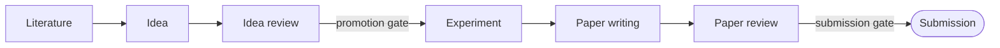

# Introduction

Polaris runs the entire research lifecycle as a single web application: literature survey, idea
generation, idea review, experiments on real GPU servers, LaTeX paper writing, and paper review.
Each stage produces durable artifacts that the next stage consumes, and every hand-off can pause at
a human approval gate — so a lab can go from "new direction" to "reviewed draft" without stitching
together notebooks, chat windows, and shell sessions.

<video controls src="./assets/polaris-demo.mp4" poster="./assets/polaris-demo-cover.jpg"></video>

## What makes it different

**Deterministic heavy lifting, LLM judgement calls.** The expensive mechanical work — crawling,
parsing, deduplication, watermark-based incremental sync, metric parsing, citation matching — is
ordinary code running in a worker. LLMs are reserved for the decisions that actually need judgement:
relevance scoring, synthesis, drafting, and review. Guardrails live in code, not prompts: experiment
numbers may only come from real run metrics, and citations must map to real knowledge-base entries.
This split keeps runs cheap, reproducible, and auditable.

**Every long task is a Voyage.** Research tasks are long-running by nature — a cold-start
literature backfill takes hours, an experiment runs for days. Polaris treats every such task as a
**Voyage**: a persisted, resumable, human-gated agent run backed by a state machine. If a worker
dies mid-run, the run resumes from its last checkpoint. Budgets auto-pause it when exceeded, steps
that need a human create an approval gate, and when the agent is genuinely stuck it asks you a
question instead of failing. Every plan, action, and verdict is retained and replayable in the UI.
The full loop — Navigator plans, Helm executes, Sextant verifies — is explained in
[Core concepts](concepts.md) and, at implementation depth, in [The task system](task-system.md).

**Built for a lab, not a single user.** Polaris is multi-user from the ground up: JWT auth with
role-based access, invite-code registration (admin-managed codes with expiry and usage limits),
per-user encrypted SSH credentials, per-call token and cost accounting attributed to user, project,
and run, and library governance (curators, monthly budgets, admin approval for shared libraries).
The first account to register becomes the platform administrator.

## The pipeline, stage by stage

| Stage | What Polaris does | Guide |
| --- | --- | --- |
| **Literature** | The Research Wiki ingests papers from OpenAlex, Semantic Scholar, and arXiv, scores relevance against each direction library's inclusion config, extracts full text and figures, and compiles a cross-linked wiki page per paper — one wiki per paper, shared platform-wide. A daily arXiv feed keeps libraries current; pgvector powers semantic search. | [Literature guide](literature.md) |
| **Idea** | Idea Forge runs multi-signal gap analysis over the knowledge base (concept co-occurrence holes, paper limitations, trend velocity), generates ideas with retrieval-planned prompts, scores them on four axes, deduplicates semantically, and hardens the winner into a full research proposal. | [Ideas guide](ideas.md) |
| **Idea review** | Configurable-persona reviewer agents debate ideas pairwise; a judge produces an Elo tournament ranking. Lab members join the discussion live, and their comments enter the agent context as first-class input. Promotion to experiment passes a human gate. | [Ideas guide](ideas.md) |
| **Experiment** | The Experiment Lab reaches your lab's GPU servers over per-user encrypted SSH. An experiment run plans the study, passes a compute-budget gate, writes code, smoke-tests it, launches runs with streamed logs and live metric curves, then iterates on the results — and pauses to ask you a question when it is stuck. | [Experiments guide](experiments.md) |
| **Paper writing** | A multi-file LaTeX project (NeurIPS, ICLR, ACL templates) with collaborative editing and server-side tectonic compilation to a live PDF. An agent drafts section by section, but numbers may only come from real experiment metrics and citations from real knowledge-base entries. | [Writing guide](writing.md) |
| **Paper review** | Line-by-line citation verification (existence and support, per citation), deterministic fact-checking of every number against the experiment record, then multi-perspective reviewer agents and a meta-review. A fabricated citation forces a non-pass. | [Paper review guide](paper-review.md) |

## The Voyage agent core

Every complex task above runs on the same engine. Three roles drive a persisted loop:

| Component | Role |
| --- | --- |
| **Navigator** | Planning. Decomposes a goal into a step plan with sub-goals, dependencies, and budget; edits the plan incrementally as evidence arrives instead of replanning from scratch. |
| **Helm** | Execution. Runs a single step — LLM calls, tool calls, SSH remote operations, literature-API queries — and returns an observation. |
| **Sextant** | Self-verification. Checks each step against structured acceptance criteria (exit code, artifact exists, schema valid, metric threshold, count, LLM rubric). Deterministic checks run first; failures feed diagnostics back to Navigator, and repeated failure on the same error escalates to a question for a human. |

Not every task needs the full cognitive loop. A shared **runtime** shell (state machine,
checkpointing, gates, budgets, cancellation, event streaming) serves all task kinds, while the
full plan–execute–verify **brain** activates only for open-ended kinds such as experiments.
Predictable pipelines — wiki compilation, idea review, paper drafting — run on fixed step
templates instead of being over-orchestrated. [The task system](task-system.md) documents the
data model, run modes, budgets, and failure handling in full.

## Try it live

A guest account on a running instance, for looking around: sign in at
<http://101.37.174.109:8080> with the username `guest` and the password `zjuguest123`. The account
is read-only and cannot call any model — it reaches every screen, admin views included, but
creating, editing, and uploading are refused, and no LLM call will run. It shows what the platform
looks like; to do real work, [run your own instance](getting-started.md).

## Beyond the pipeline

- **[PolarisBuddy](buddy.md)** — an in-app assistant that rides along on every page: a multi-turn
  tool loop over the platform's read-only tool layer, with chat, plan, and goal modes, page context,
  and persistent per-user memory.
- **[Skills](skills.md)** — agent behavior packaged as data, not code: guidance, rubric, persona,
  and workflow packs injected into agent prompts, with a marketplace and per-run snapshots for
  reproducibility.
- **[MCP](mcp.md)** — the same read-only tool layer exposed as an MCP server (Streamable HTTP and
  stdio), so Claude Code, Codex, or Cursor can read your research workspace directly.

## Where to go next

| If you want to… | Read |
| --- | --- |
| Install and run Polaris | [Getting started](getting-started.md) |
| Understand the mental model (pipeline, Voyages, skills, tools) | [Core concepts](concepts.md) |
| See how the system is put together | [Architecture](architecture.md) |
| Configure environment variables and model routing | [Configuration](configuration.md) |
| Deploy for your lab | [Deployment](deployment.md) |
| Install the desktop client | [Desktop](desktop.md) |

> [!TIP]
> New to Polaris? The shortest useful path is: [get it running](getting-started.md), create a
> direction library and let the literature stage build your corpus
> ([Literature guide](literature.md)), then work forward through the pipeline one stage at a time.
