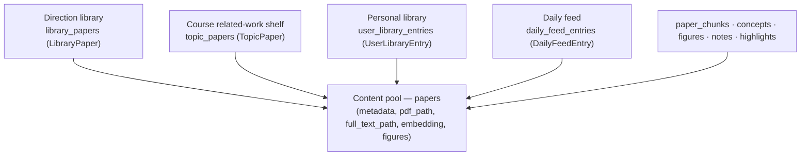

# Literature Management

This document explains how Polaris stores and manages papers: the **single content pool** that holds
every paper exactly once, the **four collections** that sit on top of it, and the **lifecycle** a
paper goes through (download, extract, chunk, embed, extract figures, compile, delete). For how the
vectors are built and searched, see [Embedding & Retrieval](embedding-and-retrieval.md).

## The big picture: one pool, four collections

Polaris never stores a paper's content twice. There is one global **content pool** (`papers`), and
every place a paper "appears" is a lightweight **membership / reference row** that points at a pool
paper. This keeps content, files, and vectors shared, and makes cross-collection reuse free.

Deduplication is by `dedup_key` (`arxiv:<id>` | `doi:<lowercased>` | `title:<normalized-hash>`,
generated in `services/dedup.py`). Before creating a pool paper, callers run `find_pool_paper(...)`;
a hit reuses the existing row and its already-downloaded PDF, full text, and vectors.

### The content pool — `papers`

The pool row (`models/paper.py::Paper`) is the single source of truth for a paper's content:

- Metadata: `title`, `authors` (`[{name, affiliations}]`), `affiliations`, `abstract`, `year`,
  `venue`, `arxiv_id`, `doi`, `url`, `published_at`, `dedup_key`, `source`.
- Derived artifacts (presence = "this step ran"): `pdf_path`, `full_text_path`, `figures` (JSON),
  `embedding` (paper-level vector), `tldr`, `relevance_score` is **not** here (it is per-collection).
- Child tables, all `ON DELETE CASCADE` from the pool paper: `paper_chunks` (full-text chunks +
  chunk vectors), `paper_concepts` links, figures rows, `paper_notes`, `paper_highlights`,
  `paper_user_meta` (per-user reading status / star), tag links.

The pool has **no per-collection state** on it. Status, relevance, per-library wiki, and trash flags
live on the membership rows.

### The four collections

All four reference the same pool paper; they differ in ownership, scope, and what work they trigger.

| Collection | Table / model | Scope & ownership | Per-row state |
| --- | --- | --- | --- |
| **Direction library** | `library_papers` / `LibraryPaper` | Lab-wide curated library (public) or a personal library; has a definition, anchors, scoring rubric, ingest cadence | `status` (`candidate`→`scored`/`excluded`→`fetched`→`compiled`; `included` = manual), `relevance_score`, `wiki_content` (per-library compiled intro), `trash_reason`, tags |
| **Course related-work shelf** | `topic_papers` / `TopicPaper` | A course's reading list ("相关研究") | `wiki_snapshot` (copied from a live library wiki at add time), `note` |
| **Personal library** | `user_library_entries` / `UserLibraryEntry` | One user's saved papers + browsing history | `saved` (True = in the library, False = a pure browsing record), snapshot of title/authors/etc., `last_paper_id` (soft link to the live pool paper, `SET NULL`), personal `wiki_content` snapshot |
| **Daily feed** | `daily_feed_entries` / `DailyFeedEntry` | Lab-wide daily arxiv feed, rolling 7-day window | `feed_date`, `primary_category`, `categories`, `announce_type` (`new`/`cross`), shared `wiki_content` |

Key relationships:

- **A paper can be in several collections at once.** Deleting it from one only removes that
  collection's membership row (see [Deletion](#deletion--garbage-collection)).
- **Direction libraries are the only collection that "builds" content** (crawl → score → fetch →
  compile → link concepts → embed). The other three are curation surfaces; when they need content
  they either reuse what a library already produced or trigger the same per-paper enrichment.
- **Personal library `saved=False` rows are browsing history, not membership.** They do not keep a
  paper alive during garbage collection.
- **Direction-library ownership** (see governance): a library is personal by default (creator +
  admins see it, billed to the creator); it can be promoted to public (lab-wide, admin-billed) via
  an admin-approved request. Papers themselves are never owned — only the pool.

## Paper lifecycle

A paper moves through a fixed set of steps. Crucially, **these steps are decoupled**: entering the
pool does not run all of them, and different entry paths run different subsets. The table at the end
of this section is the quick reference.

### 1. Entering the pool

A pool paper is created (deduped first) by one of:

- **Direction-library ingest** (`agents/voyage/actions_wiki.py`): the Voyage `wiki.search_candidates`
  / `wiki.snowball` steps crawl arXiv / Semantic Scholar / OpenAlex and create pool papers +
  `candidate` membership rows.
- **Manual add** (`POST /projects/{id}/papers`, `POST /libraries/{id}/papers`, shelf import): resolves
  metadata from arxiv / doi / bibtex, dedupes, creates the pool row (metadata only) + a membership,
  and hands the heavy work to a background task (below).
- **Daily sync** (`services/daily_feed.py::sync_daily_feed`): fetches each category's new arXiv
  announcements into the pool as **lightweight rows — no PDF, no LLM** — plus a feed entry.
- **Collect from the daily feed** (`POST /daily/collect`): distributes an existing pool paper into a
  library / shelf / personal library, then launches the same enrichment task as manual add.

### 2. Download PDF · 3. Extract full text

- Only papers with an `arxiv_id` can be auto-downloaded (`arxiv.download_pdf` → `save_pdf`). DOI-only
  and bibtex papers usually stay abstract-only.
- Full text is extracted from the PDF (`pdf_extract.extract_full_text`). Success sets
  `full_text_path`.
- Both steps are **idempotent**: `enrich_paper` skips download when `pdf_path` is set and skips
  extraction when `full_text_path` is set.

### 4. Chunk (full-text splitting)

- `chunks.py::index_paper_fulltext` reads `full_text_path` and splits it into `PaperChunk` rows
  (~1200-char chunks, ≤120 per paper). Text only — vectors come later.
- **Guarded by "chunk only if none exist"** so a paper that already has chunks (e.g. from another
  library's ingest) is never re-sliced (which would drop its chunk vectors).

### 5. Paper-level embedding · 6. Chunk embedding

See [Embedding & Retrieval](embedding-and-retrieval.md) for the details. In short: the paper-level
vector (`Paper.embedding`) is always produced by the add / ingest paths; the chunk vectors
(`PaperChunk.embedding`) are heavier and are **gated by the per-user `chat_fulltext_index` opt-in**.

### 7. Extract figures

- `pdf_extract.extract_figures` pulls figure candidates from the PDF; an LLM then captions/ranks
  them (`figure_annotate`).
- **Figures are extracted lazily, at wiki-compile time** — not when the full text is extracted.
  `wiki_compile.compile_paper` extracts figures only when the paper has none yet; the daily-paper
  compile does the same. Ingest is the one path that extracts figures during the fetch step.

### 8. Compile the wiki · 9. Link concepts · 10. Score relevance

- **Compile** (`wiki_compile.compile_paper`): an LLM reads the full text (or abstract) + figures and
  writes the illustrated markdown intro. For a direction library the result is stored on the
  membership's `wiki_content`; daily papers store it on the feed entry.
- **Link concepts** (ingest `wiki.link_concepts`): extracts/links canonical concepts and, in the same
  step, fills any missing paper-level and chunk embeddings.
- **Score** (`relevance.py`): an LLM scores the paper against the library's definition, writing
  `relevance_score` on the membership. Manual adds score against the origin library; ingest scores
  `candidate` rows.
- **Author ↔ affiliation** (`services/affiliations.py`): per-author institutions, from OpenAlex
  (structured, for DOI papers) or an LLM read of the title page. An admin setting picks whether this
  runs at add time or is folded into the compile call.

### Deletion & garbage collection

Removal is layered:

1. **Soft delete (trash)**: the membership `status` becomes `excluded` with a `trash_reason`. The
   paper stays visible in the trash and can be restored.
2. **Permanent delete / empty trash**: the **membership row** is removed (plus that library's tag
   links). All per-paper delete/restore is **library-scoped** — it acts only on the membership of the
   library you are viewing, never on another library's copy.
3. **Orphan garbage collection** (`papers.py::gc_orphan_papers`): after a permanent delete, if the
   pool paper is no longer referenced by **any** collection — no `library_papers`, no `topic_papers`,
   no **saved** `user_library_entries`, no `daily_feed_entries`, and no manuscript citation — then the
   pool `Paper` row is deleted (DB cascades chunks/notes/highlights/meta/tags/figure rows) and its
   on-disk files (`<id>.pdf`, `<id>.txt`, `<id>/figures/`) are removed. A paper still referenced
   anywhere is kept untouched.
4. **Daily-feed expiry** runs the same orphan GC: when a daily entry rolls off the 7-day window, an
   uncollected paper that is orphaned is reclaimed instead of piling up in the pool.

This is why a truly single-collection paper is fully removed (re-adding re-downloads it), while a
shared one only loses one membership.

### Path × step quick reference

| Step | Direction-library ingest | Manual add / Daily collect (`enrich_paper`) | Fetch PDF (`fetch_pdf`) | Wiki compile / recompile | Daily sync |
| --- | :---: | :---: | :---: | :---: | :---: |
| Create pool row | ✓ | ✓ | — | — | ✓ (lightweight) |
| Download PDF | ✓ | ✓ (arxiv) | ✓ | — | — |
| Extract full text | ✓ | ✓ | ✓ | — | — |
| Chunk | ✓ | ✓ | ✓ | — | — |
| Paper-level embedding | ✓ | ✓ | ✓ | — | (planned, opt-in) |
| Chunk embedding | ✓ | opt-in | opt-in | — | — |
| Extract figures | ✓ | — | — | ✓ (lazy) | — |
| Compile wiki | ✓ | — | — | ✓ | — |
| Score relevance | ✓ | ✓ (with target) | — | — | — |

"opt-in" = only when the user's `chat_fulltext_index` setting is on. "planned" = the daily
paper-level embedding is an admin-gated addition (see the retrieval doc).
