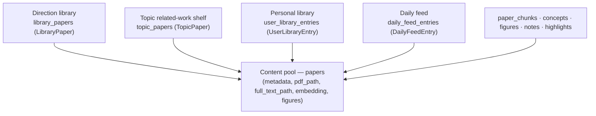

# Literature Management

This document explains how Polaris stores and manages papers: the **single content pool** that holds
every paper exactly once, the **four collections** that sit on top of it, and the **lifecycle** a
paper goes through (download, extract, chunk, embed, extract figures, compile, trash, delete). For how
the vectors are built and searched, see [Embedding & Retrieval](embedding-and-retrieval.md); for the
agent runs that do the building, see [The Task System](task-system.md).

A note on names: what the UI calls a 课题 is a **topic** (tables `projects`, `topic_papers`,
`topic_source_libraries`); a 文献库 is a **direction library** (`direction_libraries`). The tables use
`project_*` and `topic_*` interchangeably for historical reasons.

## The big picture: one pool, four collections

Polaris never stores a paper's content twice. There is one global **content pool** (`papers`), and
every place a paper "appears" is a lightweight **membership / reference row** that points at a pool
paper. This keeps content, files, and vectors shared, and makes cross-collection reuse free.

```mermaid
flowchart TD
    POOL["Content pool — papers\n(metadata, pdf_path, full_text_path, embedding, figures)"]
    DL["Direction library\nlibrary_papers (LibraryPaper)"]
    SH["Topic related-work shelf\ntopic_papers (TopicPaper)"]
    PL["Personal library\nuser_library_entries (UserLibraryEntry)"]
    DF["Daily feed\ndaily_feed_entries (DailyFeedEntry)"]
    DL --> POOL
    SH --> POOL
    PL --> POOL
    DF --> POOL
    CH["paper_chunks · concepts · figures · notes · highlights"] --> POOL
```

Deduplication is by `dedup_key` (`arxiv:<id>` | `doi:<lowercased>` | `title:<normalized-hash>`,
generated in `services/dedup.py`). Before creating a pool paper, callers run `find_pool_paper(...)`;
a hit reuses the existing row and its already-downloaded PDF, full text, and vectors.

### The content pool — `papers`

The pool row (`models/paper.py::Paper`) is the single source of truth for a paper's content:

- Metadata: `title`, `authors` (`[{name, affiliations}]`), `affiliations`, `abstract`, `year`,
  `venue`, `arxiv_id`, `doi`, `url`, `published_at`, `dedup_key`, `source`.
- Derived artifacts (presence = "this step ran"): `pdf_path`, `full_text_path`, `figures` (JSON),
  `embedding` (paper-level vector), `tldr`, `relevance_score` is **not** here (it is per-collection).
- Child tables, all `ON DELETE CASCADE` from the pool paper: `paper_chunks` (full-text chunks +
  chunk vectors), `paper_concepts` links, figures rows, `paper_notes`, `paper_highlights`,
  `paper_user_meta` (per-user reading status / star), library tag links (`paper_tag_links`), personal
  tags (`user_paper_tags`).

The pool has **no per-collection state** on it. Status, relevance, per-library wiki, and trash flags
live on the membership rows.

### The four collections

All four reference the same pool paper; they differ in ownership, scope, and what work they trigger.

| Collection | Table / model | Scope & ownership | Per-row state |
| --- | --- | --- | --- |
| **Direction library** | `library_papers` / `LibraryPaper` | A public lab-wide library or a personal one; has a definition, anchors, scoring rubric, ingest cadence | `status` (`candidate`→`scored`/`excluded`→`fetched`→`compiled`; `included` = manual), `relevance_score`, `tldr_note`, `wiki_content` (per-library compiled intro), `trash_reason`, `scored_at`, `compiled_at`, `compiled_model`, tags |
| **Topic related-work shelf** | `topic_papers` / `TopicPaper` | A topic's reading list ("相关研究") | `source_library_id`, `wiki_snapshot` (copied from a live library wiki at add time) + `snapshot_at`, `note`, `added_by`, `trashed_at` / `trashed_by` |
| **Personal library** | `user_library_entries` / `UserLibraryEntry` | One user's saved papers + browsing history | `dedup_key`, `saved` + `saved_at`, `trashed_at`, snapshot of title/authors/etc., `last_paper_id` (soft link to the live pool paper, `SET NULL`), personal `wiki_content` snapshot, `note`, `visit_count` / `last_visited_at` |
| **Daily feed** | `daily_feed_entries` / `DailyFeedEntry` | Lab-wide daily arXiv feed, rolling 7-day window (`DAILY_FEED_RETENTION_DAYS = 7`) | `feed_date`, `primary_category`, `categories`, `announce_type` (`new`/`cross`), shared `wiki_content` + `wiki_model` |

Key relationships:

- **A paper can be in several collections at once.** Deleting it from one only removes that
  collection's membership row (see [Deletion](#deletion--garbage-collection)).
- **Direction libraries are the only collection that "builds" content** (crawl → score → fetch →
  compile → link concepts → embed). The other three are curation surfaces; when they need content
  they either reuse what a library already produced or trigger the same per-paper enrichment.
- **Personal library rows with `saved=False` are either browsing history or trash.** A pure browsing
  record and a trashed entry are both `saved=False`; `trashed_at` is what tells them apart. Neither
  keeps a paper alive during garbage collection.
- **Papers are never owned — only the pool row exists once, and collections point at it.** Ownership
  and billing are properties of the *library*, not of any paper.

### Who owns and manages a direction library

A library is personal by default and can be promoted to public (lab-wide) through an admin-approved
request; `direction_libraries.is_public` and `status` (`pending` / `active` / `rejected`) carry that.
Billing follows the same line: a public library's ingest uses the global key, a personal one is billed
to its creator.

**Management rights no longer follow the origin topic.** `can_manage_library()` in
`services/libraries.py` accepts exactly three identities:

1. platform admins (`users.role == "admin"`);
2. the creator (`direction_libraries.submitted_by`);
3. curators (`direction_library_curators`).

Being a member of the topic the library was originally created from grants nothing. When that rule
changed, a migration backfilled the affected people as curators, so nobody lost access.

Two consequences worth keeping straight:

- **`DirectionLibrary.project_id` is history, not ownership.** It records which topic the library was
  originally created from (and is `unique`, since that relationship was 1:1). Libraries created
  through `POST /libraries` have it `NULL`, and creating a topic no longer auto-creates a library at
  all (`services/projects.py::create_project` only writes the topic, its owner membership, and any
  libraries the creator chose to link).
- **"Which libraries does my topic use" is answered by the association table**
  `topic_source_libraries` (`TopicSourceLibrary`, keyed on `topic_id` + `library_id`), via
  `get_source_libraries()` / `set_source_libraries()`. A topic can link many libraries and a library
  can serve many topics. `get_library_for_project()` still exists for the paths that need "the one
  library behind this topic" — it resolves the origin library by `project_id`, else the
  first-associated one, else `None` — but it no longer creates anything.

Topic-scoped literature endpoints (`/projects/{id}/...`) use a different gate,
`get_managed_project()`: topic members pass, plus admins, plus curators of the topic's origin
library. So topic membership still lets you manage papers *through the topic*, just not through
`/libraries/{id}/...`.

## Paper lifecycle

A paper moves through a fixed set of steps. Crucially, **these steps are decoupled**: entering the
pool does not run all of them, and different entry paths run different subsets. The table at the end
of this section is the quick reference.

### 1. Entering the pool

A pool paper is created (deduped first) by one of:

- **Direction-library ingest** (`agents/voyage/actions_wiki.py`): the `wiki.search_candidates` /
  `wiki.snowball` steps of a `wiki_bootstrap` / `wiki_ingest` task crawl arXiv / Semantic Scholar /
  OpenAlex and create pool papers + `candidate` membership rows. See
  [The Task System](task-system.md#51-building-a-library--wiki_ingest) for the full run.
- **Manual add** (`POST /projects/{id}/papers`, `POST /libraries/{id}/papers`, shelf import): resolves
  metadata from arxiv / doi / bibtex, dedupes, creates the pool row (metadata only) + a membership,
  and hands the heavy work to a background task (below).
- **Manual add into the personal library** (`POST /me/library/import`, body is one of `arxiv_id` /
  `doi` / `bibtex`): same resolve-or-create pool path as shelf import
  (`paper_import.resolve_or_create_pool_paper`; a parse failure is `422 PARSE_FAILED`) but **no
  membership row at all** — the paper only gets a `user_library_entries` row (`saved=True`; an entry
  sitting in the caller's trash is revived instead of duplicated). Enrichment runs with no library and
  no topic, so nothing is scored. Login is the only requirement, and the response carries a `task_id`
  for the progress stream.
- **Daily sync** (`daily_feed_sync` task, steps `daily.fetch` → `daily.upsert`): fetches each
  subscribed category's new arXiv announcements into the pool as **lightweight rows — no PDF, no
  LLM** — plus a feed entry. This runs through the task system, so it has a plan, per-step status,
  a terminal and a retry button; see
  [The Task System](task-system.md#52-daily-new-papers--daily_feed_sync). The direct function
  `services/daily_feed.py::sync_daily_feed` still exists and shares the same step functions, but it
  is only used by scripts and tests.
- **Collect from the daily feed** (`POST /daily/collect`, body `{paper_ids, direction_library_ids,
  topic_ids, personal}`): distributes an existing pool paper into libraries / shelves / the personal
  library, then launches the same enrichment task as manual add.

### 2. Download PDF · 3. Extract full text

- Only papers with an `arxiv_id` can be auto-downloaded (`arxiv.download_pdf` → `save_pdf`). DOI-only
  and bibtex papers usually stay abstract-only.
- Full text is extracted from the PDF (`pdf_extract.extract_full_text`). Success sets
  `full_text_path`.
- Both steps are **idempotent**: `enrich_paper` skips download when `pdf_path` is set and skips
  extraction when `full_text_path` is set.

### 4. Chunk (full-text splitting)

- `chunks.py::index_paper_fulltext` reads `full_text_path` and splits it into `PaperChunk` rows
  (~1200-char chunks, ≤120 per paper). Text only — vectors come later.
- **Guarded by "chunk only if none exist"** so a paper that already has chunks (e.g. from another
  library's ingest) is never re-sliced (which would drop its chunk vectors).

### 5. Paper-level embedding · 6. Chunk embedding

See [Embedding & Retrieval](embedding-and-retrieval.md) for the details. In short: the paper-level
vector (`Paper.embedding`) is always produced by the add / ingest paths; the chunk vectors
(`PaperChunk.embedding`) are heavier and are **gated by the per-user `chat_fulltext_index` opt-in**.

### 7. Extract figures

- `pdf_extract.extract_figures` pulls figure candidates from the PDF; an LLM then captions/ranks
  them (`figure_annotate`).
- **Figures are extracted lazily, at wiki-compile time** — not when the full text is extracted.
  `wiki_compile.compile_paper` extracts figures only when the paper has none yet; the daily-paper
  compile does the same. Ingest is the one path that extracts figures during the fetch step.

### 8. Compile the wiki · 9. Link concepts · 10. Score relevance

- **Compile** (`wiki_compile.compile_paper`): an LLM reads the full text (or abstract) + figures and
  writes the illustrated markdown intro. For a direction library the result is stored on the
  membership's `wiki_content`; daily papers store it on the feed entry.
- **Link concepts** (ingest `wiki.link_concepts`): extracts/links canonical concepts and, in the same
  step, fills any missing paper-level and chunk embeddings.
- **Score** (`relevance.py`): an LLM scores the paper against the library's definition, writing
  `relevance_score` on the membership. Ingest scores `candidate` rows. A manual add scores against
  whichever library the target resolves to — the library itself for `POST /libraries/{id}/papers`,
  the topic's resolved library for `POST /projects/{id}/papers`, and **nothing at all** for
  `POST /me/library/import`, which has no library.
- **Author ↔ affiliation** (`services/affiliations.py`): per-author institutions, from OpenAlex
  (structured, for DOI papers) or an LLM read of the title page. The admin setting
  `affiliation_extraction_mode` picks whether this runs at add time (`on_add`) or is folded into the
  compile call.

### Path × step quick reference

| Step | Direction-library ingest | Manual add / Daily collect (`enrich_paper`) | Fetch PDF (`fetch_pdf`) | Wiki compile / recompile | Daily sync |
| --- | :---: | :---: | :---: | :---: | :---: |
| Create pool row | ✓ | ✓ | — | — | ✓ (lightweight) |
| Download PDF | ✓ | ✓ (arxiv) | ✓ | — | — |
| Extract full text | ✓ | ✓ | ✓ | — | — |
| Chunk | ✓ | ✓ | ✓ | — | — |
| Paper-level embedding | ✓ | ✓ | ✓ | — | admin opt-in |
| Chunk embedding | ✓ | user opt-in | user opt-in | — | — |
| Extract figures | ✓ | — | — | ✓ (lazy) | — |
| Compile wiki | ✓ | — | — | ✓ | — |
| Score relevance | ✓ | ✓ (with target) | — | — | — |
| Author affiliations | ✓ | `on_add` only | `on_add` only | ✓ (other modes) | — |

"user opt-in" = only when that user's `chat_fulltext_index` setting is on. "admin opt-in" = only when
`daily_feed_embed_enabled` is on (off by default); see
[Embedding & Retrieval](embedding-and-retrieval.md). "with target" = a scoring target library was
supplied — a personal-library import has none, so nothing is scored. All of these steps are
idempotent — an existing PDF, chunk set, or vector is never redone. `enrich_paper` publishes its
progress as the stages `download` → `extract` → `embed` → `score`; chunking and affiliation
extraction happen inline without their own stage event.

## Tags

There are two independent tagging systems, and they never mix.

| | Library tags | Personal tags |
| --- | --- | --- |
| Tables | `paper_tags` (unique per `library_id` + `name`) + `paper_tag_links` | `user_paper_tags` (unique per `user_id` + `paper_id` + `name`) |
| Scope | one direction library; everyone looking at that library sees the same tags | one user, across every paper they can read |
| Reach | requires manage rights on the library | any readable paper, including pool-only ones |
| Endpoints | `GET /projects/{id}/tags`, `GET /libraries/{id}/tags`, `PUT /papers/{paper_id}/tags` | `GET /me/paper-tags`, `PUT /papers/{paper_id}/my-tags` |

Personal tags are a flat `(user, paper, name)` table by design — there is no tag entity to keep
tidy, so there is no orphan-tag cleanup. They can be used as a filter in the shelf list, the personal
library, and library / topic paper lists (the `my_tag` query parameter).

**Only personal tags have a UI entry point today.** The library-tag controls were removed from the
frontend; the endpoints, the tables, and the existing rows are all still there, and the API client
still declares the calls, but no component invokes them. Treat library tags as dormant, not deleted.

## Trash

Three of the four collections have a trash ("回收站"); each implements it differently, which is
worth knowing before writing a query.

| Collection | Trash mechanism | Endpoints |
| --- | --- | --- |
| Direction library | `library_papers.status = 'excluded'` + `trash_reason` (`manual` for a user delete, `irrelevant` for auto-exclusion during scoring). **No `trashed_at` column.** | library / topic paper list with the trash filter, restore, delete |
| Topic shelf | `topic_papers.trashed_at` + `trashed_by` (index `(topic_id, trashed_at)`) | `GET /projects/{id}/shelf?trashed=true`, `POST /projects/{id}/shelf/{paper_id}/restore`, `DELETE /projects/{id}/shelf/{paper_id}?hard=true\|false`, `POST /projects/{id}/shelf/trash/empty` |
| Personal library | `user_library_entries.trashed_at` (trashing also sets `saved=False`) | `GET /me/library?tab=trash`, `POST /me/library/{entry_id}/restore`, `DELETE /me/library/{entry_id}?mode=unsave\|purge`, `POST /me/library/trash/empty` |
| Daily feed | none — entries roll off the 7-day window | — |

Three consequences that are easy to get wrong:

- **A trashed row does not count as "still referenced."** Orphan GC ignores `topic_papers` rows with
  a `trashed_at`, and ignores personal entries that are not `saved`. So trashing the last shelf copy
  of a paper does not, by itself, protect it from being reclaimed. (Direction-library memberships are
  the exception — see the GC rules below.)
- **Re-adding a trashed paper revives the original row; it never inserts a second one.** On the
  shelf, `add_to_shelf` reloads the existing row ignoring the trash flag, clears `trashed_at` /
  `trashed_by`, and re-resolves the source library and wiki snapshot — the unique constraint on
  `(topic_id, paper_id)` covers trashed rows, so a plain insert would collide anyway. In the personal
  library, `save_paper` finds the entry by `dedup_key` and clears `trashed_at`; merely *visiting* the
  paper (`record_visit`) also un-trashes it.
- **Clearing browsing history leaves the trash alone.** It deletes only entries that are both
  `saved=False` **and** `trashed_at IS NULL`, and resets visit counters only on non-trashed rows.

## Deletion & garbage collection

Removal is layered:

1. **Soft delete (trash)**: see above. The paper stays visible in that collection's trash and can be
   restored.
2. **Permanent delete / empty trash**: the **membership row** is removed (plus that library's tag
   links). All per-paper delete/restore is **collection-scoped** — it acts only on the membership of
   the library / shelf / personal library you are viewing, never on another collection's copy.
3. **Orphan garbage collection** (`papers.py::gc_orphan_papers`, via `_paper_still_referenced`):
   after a permanent delete, the pool paper is kept if **any** of these still points at it —

   - any `library_papers` row, **regardless of status** (so an `excluded` / trashed library
     membership does keep the paper alive);
   - a `topic_papers` row with `trashed_at IS NULL`;
   - a `daily_feed_entries` row;
   - a `user_publications` row (a user's claimed publication);
   - a `user_library_entries` row with `saved = True`, matched either by `last_paper_id` or by
     `dedup_key`.

   If nothing matches, the pool `Paper` row is deleted (the database cascades chunks, concept links,
   figure rows, notes, highlights, per-user meta and tags) and its on-disk files are removed
   (`<id>.pdf`, `<id>.txt`, `<papers_dir>/<id>/`).
4. **Daily-feed expiry** runs the same orphan GC: when a daily entry rolls off the 7-day window, an
   uncollected paper that is orphaned is reclaimed instead of piling up in the pool.

This is why a truly single-collection paper is fully removed (re-adding re-downloads it), while a
shared one only loses one membership.

## Lab-wide counts

`GET /lab/stats` (`api/lab.py`, service `services/lab.py::lab_stats`) is the single read model behind
the lab workspace's overview. It returns `libraries {total, public, personal}`, `papers {pool_total,
library_members_deduped, compiled}`, `concepts {total}`, `chunks {papers_with_chunks, total_chunks,
chunks_with_embedding, vector_search_supported}`, `vectors {papers_with_embedding, papers_total}` and
`leaderboard_enabled`. Everything except `pool_total` is scoped to the libraries the caller can see;
`pool_total` is the global content-pool count, which is why it is usually larger than the sum of the
per-library numbers.

The same router carries three siblings: `GET /lab/usage?days=` (token usage over time),
`GET /lab/usage/leaderboard?days=&limit=` (`403 LEADERBOARD_DISABLED` for non-admins when the
`lab_leaderboard_enabled` setting is off), and `GET /lab/graph?library_id=` (the concept graph for one
library, `404 LIBRARY_NOT_FOUND` if it is not visible to the caller). All four are read-only and
require login.
