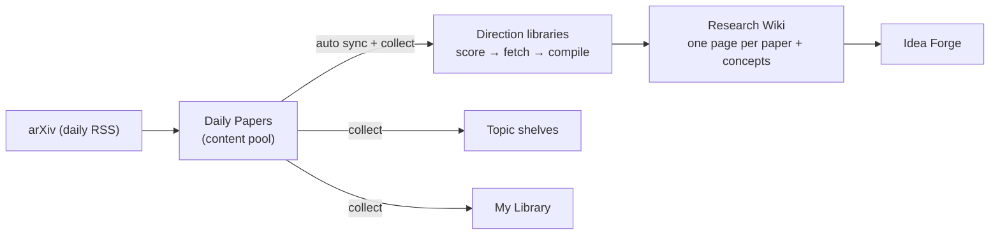

# Literature

The literature stage is where Polaris builds the knowledge base every later stage runs on. Instead of
retrieving papers on demand, Polaris **compiles** them up front: papers flow in from arXiv every day,
get scored against your research direction, downloaded, read by an LLM, and turned into a
cross-linked **Research Wiki** — one illustrated wiki page per paper, plus a growing dictionary of
concepts. This page is the user guide; the internals live in
[Literature Management](literature-management.md), [Wikis & Concepts](wiki-and-concepts.md), and
[Embedding & Retrieval](embedding-and-retrieval.md).

## The building blocks

Every paper is stored exactly once, in a global content pool. Four collections sit on top of it as
lightweight membership layers, so the same paper can appear in several places without ever being
duplicated:

| Collection | Where in the UI | What it is |
| --- | --- | --- |
| **Direction library** | Libraries | A research direction with an inclusion config; the only collection that *builds* content (score → fetch → compile) |
| **Daily feed** | Daily Papers | The lab-wide feed of each day's new arXiv papers — the single arXiv entry point |
| **Topic shelf** | Related Work (per topic) | A topic's curated reading list |
| **Personal library** | My Library | Your saved papers and browsing history |

Deleting a paper from one collection never touches the others; a paper referenced by nothing is
eventually garbage-collected. Details:
[one pool, four collections](literature-management.md#the-big-picture-one-pool-four-collections).

## Direction libraries

A direction library is a research direction made operational: a statement of what the direction is,
plus an inclusion config that decides which papers belong. Libraries live under **Libraries** in the
Lab section.

### Creating one

Click **New library**. Two fields matter:

- **Name** — display only.
- **Statement** — required, and load-bearing: it is embedded to pre-rank candidate papers and it
  anchors the LLM relevance scoring. Write it in English (arXiv abstracts are English) as a focused
  3–5 sentence paragraph.

If you are not sure what to write, click **Write it with AI**: a short structured interview
(**AI interview: pin down the direction**) walks you through four questions — the core research
question, the subject of study, the sub-problems you care about, and the method types you want or
explicitly don't want — each with checkbox options plus free text, then drafts the statement for
you. Accept it with **Use this statement**.

A new library is **personal**: usable immediately, visible to you and admins only. To share it
lab-wide, use **Request to make public**; an admin approves or rejects the request, and the library
stays usable while pending. Admins can also manage **Library managers** (extra people with manage
rights) and each library carries an optional **Monthly AI budget** in tokens — syncs stop with a
clear message when it is spent, and the **AI usage this month** card in **Library config** shows
where you stand.

### Inclusion settings

The **Inclusion settings** card in **Library config** holds the machine-readable half of the
direction:

- **arXiv categories** — which categories the search mode queries (quick chips for common ones like
  `cs.CL`, `cs.LG`).
- **Include terms** / **Exclude terms** — keywords that steer candidate search; exclude terms also
  hard-filter the daily sync.
- **Anchor papers** — known key papers of the direction (title + arXiv id); these seed citation
  snowballing.
- **Scoring rubric** — optional weighted dimensions (name, what counts as a good score, weight) that
  are handed to the relevance scorer alongside the statement.

<!-- screenshot: the Library config tab with the Inclusion settings card open — categories, include/exclude terms, anchor papers, rubric dimensions -->

## Getting papers in

### The daily feed

**Daily Papers** is the lab-wide feed of each day's new arXiv announcements (`new` and `cross`
listings) in the categories an admin subscribes (default `cs.AI`, `cs.CL`, `cs.CV`). A worker probes
arXiv from a configurable time each day (default 01:30 UTC) until the day's batch actually appears;
weekends show as quiet because arXiv does not publish. Feed papers enter the content pool as
lightweight rows — metadata and abstract, no PDF, no LLM cost — and get embeddings so semantic
search works over them immediately.

The feed is also the platform's **single arXiv entry point**: direction libraries do not crawl arXiv
on their own schedule; the daily sync task fans out to every due library right after new papers
land, and each library filters the pool. Entries roll off after a retention window (default 14 days,
admin-configurable 1–90).

On the page you can filter by day, category, and announcement type, search the pool (keyword or
semantic), like papers (likes are lab-wide, with a likers preview), read the abstract, trigger a
one-off **Compile** for an **AI intro**, and — the main action — **Add to libraries**: a tree modal
that distributes selected papers into **Shared libraries**, **Topic related work** shelves, and
**My library** in one click. Collected papers are enriched in the background (PDF, full text,
embeddings, and a relevance score against the first library you collected into).

<!-- screenshot: the Daily Papers page — day navigation, category filter, paper list with like facepiles, and the "Add to libraries" tree modal open -->

### Building and syncing a library

The **Ingest & sync** tab of a library workspace offers three ways to bring papers in, all running
as resumable [tasks](task-system.md) with a live step plan:

1. **Search and admit** — a cold-start crawl of the arXiv query API using your categories and
   include/exclude terms, over a time range preset (1 week / 3 months / 6 months / 1 year). Knobs:
   **Relevance threshold**, **Max papers** (default 150), **Max compiled papers** (default 50), and
   **Maximize (no paper cap)** for a full backfill.
2. **Expand from anchor papers** — citation snowballing: your anchor papers (those with an arXiv id)
   plus the library's most recent candidates are looked up on Semantic Scholar, and both their
   references and their citations become candidates, for 1 or 2 **hops**. This is how you bootstrap
   a direction whose vocabulary is too diffuse for keyword search.
3. **Sync now / automatic daily sync** — incremental mode. Candidates come from the daily-feed pool
   only: pool papers are vector-ranked against the library's statement and include terms, exclude
   terms hard-filter, and previously rejected papers are remembered and skipped. Once a library has
   had its initial build, it syncs automatically every day after the feed lands — the tab shows
   **Last sync** and **Next auto sync (approx.)**. The scan scope is an admin setting: since last
   sync (default), today only, or the whole pool.

Every mode then runs the same tail: relevance scoring, fetch and extract, wiki compile, concept
linking, and a research digest.

### Relevance scoring

An LLM reads each candidate's title and abstract against the library's inclusion config — statement,
include/exclude terms, rubric — and returns a score between 0 and 1, a reason, and a one-line TL;DR.
Papers at or above the run's **Relevance threshold** (default 0.8) are kept and move on to fetching;
papers below it are dropped and remembered so they are never re-scored. Manually added or collected
papers are also scored for the ring display, but stay in the library regardless of the number. The
score appears as a **Relevance** ring on every paper card, with the reason on the detail view.

## The paper lifecycle

A kept paper goes through a fixed, idempotent pipeline (each step is skipped if its output already
exists — including when another library already did the work, since the pool is shared):

1. **Download PDF** — automatic for arXiv papers; DOI- or BibTeX-imported papers usually stay
   abstract-only.
2. **Extract full text** from the PDF.
3. **Chunk and embed** — the text is split into ~1200-character chunks; a paper-level vector and
   per-chunk vectors are built for semantic search and literature chat (see
   [Embedding & Retrieval](embedding-and-retrieval.md)).
4. **Extract figures** — candidate figures are pulled from the PDF, and a vision model picks the few
   that matter and captions them.
5. **Compile the wiki** — the Librarian model writes the paper's wiki page from the full text and
   the important figures.

The full step-by-step reference, including which entry path runs which steps, is in
[Literature Management](literature-management.md#paper-lifecycle).

## The Research Wiki

### One page per paper

Compiling produces a long illustrated read-through of the paper — not a summary snippet. The article
follows a fixed skeleton: **TL;DR**, background and motivation, method, experiments and results, and
discussion with concrete takeaways, with the selected figures embedded inline at the right points
and math rendered as LaTeX. The prose is currently written in Chinese.

**There is one wiki per paper, shared platform-wide.** The compile deliberately carries no library
context, so the same paper reads identically from a library, the daily feed, a shelf, or your
personal library. Anyone with model access can **Recompile** a page; that overwrites the single
shared copy (the UI shows who compiled it, with which model, and asks for confirmation — there is no
version history). Why it works this way:
[compiling carries no library context](wiki-and-concepts.md#13-compiling-carries-no-library-context--on-purpose).

### Concepts and backlinks

While writing, the Librarian marks key cross-paper terms inline as `[[double-bracket]]` links. Those
marks are harvested into the **concept library** — the lab's accumulated dictionary of methods,
architectures, problems, metrics, and datasets:

- A freshly harvested name is only a *candidate*. It is **promoted to a visible concept once two
  distinct papers cite it**; at promotion an LLM writes its one-line definition and category, and
  weeds out non-concepts (figure references, coined names). Until then a `[[link]]` politely reports
  "not in the knowledge base yet".
- A concept page shows the definition, category, and every paper that mentions it — scoped to the
  library you came from, or platform-wide when opened from a pool surface like the feed.
- The **Concepts** tab lists a library's derived vocabulary; the **Graph** tab draws the
  concept–paper network.

The harvesting, promotion gate, definition batching, and repair tooling are documented in
[Wikis & Concepts](wiki-and-concepts.md).

## Reading a paper

Every paper opens in the **reader**: the PDF on the left, and a dockable four-panel column on the
right —

- **Highlights** — drag-select passages in the PDF; click a highlight to jump back to it.
- **Notes** — your Markdown notes on the paper, with edit/preview.
- **AI chat** — ask the model about this paper; any answer can be kept with **Save as note**.
- **Paper info** — abstract, metadata, relevance, and the **AI intro** (the compiled wiki page)
  rendered in place.

Header actions add the paper to the current topic's related work, save it to **My Library**, or star
it. For distraction-free reading of the wiki article itself, **Reading mode** opens it full-screen
with a PDF export.

<!-- screenshot: the paper reader — PDF left, right dock showing the AI chat panel and the Paper info panel with the compiled wiki -->

## Search

- **In a library or topic**: the paper list search toggles between **keyword** (title, abstract,
  wiki body, and your own notes) and **semantic** — natural-language queries answered by vector
  recall plus an LLM rerank. Filter chips cover compiled/starred, author, affiliation, and year.
- **Daily Papers** and **My Library** (saved tab) offer the same semantic toggle over their own
  scopes.
- **The global palette** (⌘K) searches the current topic across papers, concepts, ideas,
  experiments, tasks, and drafts — keyword only, no model call.

::: warning Semantic search needs PostgreSQL
Semantic mode requires pgvector, i.e. the standard Docker deployment. On other database backends the
toggle silently falls back to keyword matching, and the UI shows a "fell back to keyword matching"
banner.
:::

## Research digests

Every library sync ends by writing a **research digest** — a daily briefing of what just came in.
The library workspace's **Daily digest** tab keeps the history:

- **Digest**: the run's counts (fetched, prescreened, kept, excluded, compiled), a per-paper section
  with TL;DR, what's interesting, how it relates to the direction, and concept links, cross-paper
  observations, and the exclusion list with reasons.
- **Rolling trends**: a synthesized view of ongoing threads across digests, each tagged emerging,
  active, converging, or stale.

**Generate today's digest** produces one on demand; if today's sync already scored papers it reuses
them instead of re-crawling.

## Shelves and your personal library

- **Related Work** (per topic) is the topic's reading list. Add papers from any library, from the
  feed, or by **Add paper** (arXiv id, DOI, or title lookup), and attach a per-topic note on why
  each one matters. Adding to a shelf also saves the paper to your personal library; removing it
  from the shelf does not un-save it. The tab's **Chat** view answers questions over the shelf's
  full texts.
- **My Library** is yours alone: **Saved** papers, browsing **History**, papers you **Liked** on the
  feed, a literature **Chat** over your saved papers, and optionally **My Publications**. Import
  directly by arXiv id, DOI, or pasted BibTeX (up to 50 entries). Removal goes through a restorable
  trash.

Both surfaces read the same shared wiki pages as everywhere else — a paper compiled in any library
is instantly readable from your shelf and your personal library.

## Obsidian vault export

Any library exports as a ready-made Obsidian vault: the export menu on the papers list offers
**Obsidian vault** (`.zip`), alongside **BibTeX citations** (`.bib`) and **CSL-JSON** (imports
straight into Zotero). The vault contains an `index.md`, one Markdown file per compiled paper with
frontmatter (title, arXiv id, year, relevance, concepts) and the wiki article with its
`[[wikilinks]]` intact, extracted figure images, one file per concept with backlinks to the papers
that use it, and your own notes appended to each paper. The export is one-way and covers the
library's compiled papers. (A reverse importer for an existing Obsidian literature vault exists as
an admin CLI, `python -m app.cli.sync_obsidian_vault`.)

## Key settings

Admin settings (Settings → Daily papers):

| Setting | Default | What it does |
| --- | --- | --- |
| Subscribed categories | `cs.AI`, `cs.CL`, `cs.CV` | Which arXiv categories the daily feed fetches |
| Retention days | 14 (1–90) | How long feed entries live; also the window library syncs can see |
| Sync time | 01:30 UTC | When the daily probe starts looking for arXiv's batch |
| Library sync scan scope | Since last sync | What slice of the pool incremental syncs consider (today only / whole pool) |

Per-run ingest knobs (Ingest & sync tab):

| Knob | Default | What it does |
| --- | --- | --- |
| Relevance threshold | 0.8 | Papers scoring below are dropped and never re-scored |
| Max papers | 150 | Candidate cap per run |
| Max compiled papers | 50 | How many of the kept papers get the full compile |
| Time range | 6 months | Search-mode lookback (1 week – 1 year presets) |
| Hops | 1 | Snowball expansion depth |
| Maximize (no paper cap) | off | Uncapped backfill for the initial build |

## Tips & limits

- **The statement is the steering wheel.** Vector pre-ranking, candidate search, and LLM scoring all
  key off it. If a sync keeps admitting the wrong papers, sharpen the statement and exclude terms
  before touching the threshold.
- **Only arXiv papers get automatic PDFs.** DOI/BibTeX imports usually stay abstract-only, which
  means a thinner wiki page and no full-text chunks for chat.
- **The feed's retention window bounds automatic ingestion.** A paper that scrolled out of the
  window can no longer be picked up by incremental sync — use search mode or a manual import to
  reach further back.
- **Recompile overwrites, with no history.** The confirmation dialog is the only safety net; the
  previous text is unrecoverable.
- **Concept links need a library.** A paper compiled only from the daily feed has a wiki full of
  `[[links]]` but no concept rows until it joins a library and a link pass runs.
- **Concepts appear at two citations.** A term marked by exactly one paper stays invisible by
  design; the second citing paper makes it appear automatically.
- **Selecting 3 hops behaves as 2.** The snowball expansion is capped at two hops at runtime even
  though the UI offers three.
- **Sync cadence is daily and not configurable** — anything sparser would permanently miss papers as
  they age out of the feed window. What you can control is the scan scope and each library's monthly
  budget.
- **Weekends are quiet.** arXiv publishes Monday–Friday; a "quiet" feed state on Saturday or Sunday
  is normal, not a failure.

## See also

- [Literature Management](literature-management.md) — the content pool, the four collections,
  ownership and trash rules, and the full lifecycle reference.
- [Wikis & Concepts](wiki-and-concepts.md) — how a wiki page is compiled and how concepts are
  harvested, promoted, and repaired.
- [Embedding & Retrieval](embedding-and-retrieval.md) — the vectors behind semantic search and
  literature chat.
- [The task system](task-system.md) — how library builds and daily syncs run, resume, and get billed.
- [Ideas & idea review](ideas.md) — what the knowledge base feeds next.
