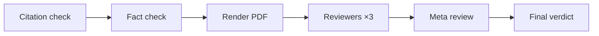

# Paper review

Before a manuscript can be submitted, Polaris puts it through an AI peer review that is deliberately
harsher than a chatty "review my paper" prompt: every citation is verified line by line against real
bibliographic databases, every number is checked deterministically against the experiment record,
and only then do multi-perspective reviewer agents score the paper and a meta-review aggregate the
verdict. A single fabricated citation forces a non-pass, no matter how good the scores are — and a
pass is the prerequisite for the submission gate.

The page lives in the topic workspace under **Paper Review**.

## How it works

A review is a fixed six-step [task](task-system.md) (kind `paper_review`; one active round per
manuscript, and the manuscript must have compiled successfully at least once):

### 1. Citation verification, line by line

Every `\cite` in the manuscript's `.tex` files is extracted deterministically, together with its
location (`file:line`) and the surrounding two sentences of context. Each cited bibkey is then
verified on two axes:

**Existence** — does the cited paper exist?

| Verdict | Meaning |
| --- | --- |
| `exact` | Matched a knowledge-base paper directly, or an external record with title similarity ≥ 0.92 and year within ±1 |
| `minor` | A close match exists (similarity ≥ 0.75, or right title with the year off) — probably a sloppy entry, not an invention |
| `fabricated` | No plausible match anywhere |

Bibkeys that map to a library paper are exact by construction. Entries that are in the bibliography
but not in the library (e.g. Semantic Scholar additions from Related Work) are re-verified remotely:
Semantic Scholar first, falling back to OpenAlex. If **both** services are unreachable the citation
is conservatively marked `minor` — a network outage never produces a fabrication verdict.

**Support** — does the cited paper actually support the claim? For each non-fabricated citation
(up to a cap of 30; the rest are `not_checked`), an LLM compares the citation context against the
cited paper's abstract, TL;DR, and — when the full text is on file — the most relevant passage, and
returns `supported`, `partial`, or `unsupported`.

The results appear as a table on the review page: existence, match source, support, and the matched
paper, with the citation context on hover.

<!-- screenshot: citation check table with existence/support pills and one fabricated row highlighted -->

### 2. Deterministic fact check

Every number in the running text is checked against the experiment record — the same fact pack the
[Paper Writer](writing.md) drafts from:

- percentages and decimals must match a real `ExperimentRun` metric value within ±0.01 (checked
  both as `x` and `x/100` for percentages); small integers, years, and "Section 3 / Table 2"-style
  references are exempt;
- `\includegraphics` may only reference figures that exist in the fact pack;
- every `\ref` must resolve to a `\label` somewhere in the sources.

This scan is plain code — no model, no discretion. On top of it, an LLM does a claim spot-check:
conclusions, comparisons, and causal statements that cannot be derived from the recorded
hypotheses/metrics/figures are flagged as `unsupported_claim` items with a severity.

### 3. Reviewer agents from multiple perspectives

The compiled PDF's first pages are rendered to images, and three reviewer agents each receive the
rendered pages, the LaTeX source, and a digest of the citation and fact findings. The default
personas mirror a top-venue committee:

- a **harsh methodologist**, hunting design flaws and unablated choices;
- a **constructive domain expert**, placing the work in the literature and suggesting fixes;
- a **strict reproducer**, who only believes checkable numbers and setups.

You can replace any of them with custom personas (name + stance) when starting the round.

Each reviewer returns a structured verdict — `soundness`, `presentation`, `contribution` (1–4),
overall `rating` (1–10), `confidence` (1–5), plus concrete strengths, weaknesses, and questions.

**Reliability screening.** Every opinion is checked by a guardrail model: is it specific, grounded
in the actual paper, free of hallucinated methods or numbers? A failing opinion is regenerated (up
to twice); if it still fails it is published but marked **unreliable** ("Failed reliability check ·
excluded from aggregate") and carries no weight.

### 4. Meta-review aggregation

Scores are aggregated with outlier suppression: the median rating is the anchor, opinions more than
3 points from the median are down-weighted ×0.5, low-confidence opinions (≤2) another ×0.5, and
unreliable opinions are excluded entirely. A meta-review chair then writes the summary —
contributions, consensus strengths, key weaknesses, revision advice — and a decision hint:

- `accept` — aggregated rating ≥ 6;
- `borderline` — within one point of the bar;
- `reject` — below that, **or forced** whenever any citation is `fabricated` or no reviewer survived
  the reliability screen.

### 5. The pass rule

::: warning A fabricated citation is an automatic fail
`review_passed = (rating ≥ 6) AND (zero fabricated citations)`. The score cannot buy back an
invented reference — the UI states it plainly: "*N possibly fabricated citations — verdict forced to
fail*".
:::

On a fail, the review writes a **revision note** into the manuscript's fact pack: every reviewer
weakness, the full fact-check list, and each citation needing attention. The next AI drafting round
reads these notes, and you can read them yourself from the fact pack drawer. A manuscript that was
already awaiting submission approval drops back to `compiled`.

## Step-by-step usage

1. Make sure the manuscript compiles (**⌘S** on the Writer page — review refuses to start without a
   successful compile).
2. Open **Paper Review**, pick the manuscript, click **Start peer review**. Optionally edit the
   three reviewer personas, then **Start review**.
3. Watch the round progress: reviewer opinions and the meta-review arrive as messages in real time.
4. Read the results top-down: **Meta review** (aggregate rating, decision), the three opinion cards
   (scores, strengths/weaknesses/questions), **Citation check**, and the fact-check list.
5. If it failed: fix the flagged citations and numbers in the [Writer](writing.md) — the revision
   notes are already in the fact pack for the next drafting pass — and start a new round.
6. If it passed: the manuscript is now submittable.

<!-- screenshot: Paper Review page with meta review card, three reviewer opinion cards, and the citation check table -->

## The submission gate

**Submit** on the Writer page requires two things: the latest compile is `ok`, and the manuscript
has `review_passed`. It then opens a `paper_submission` approval gate carrying the title, compile
version, and review status. A project approver decides it under **Approvals**:

- **Approve** → the manuscript is marked `submitted`;
- **Reject** → it returns to `compiled` for another pass.

The review requirement is re-checked at approval time; an administrator can explicitly override it
when approving, but by default no paper reaches `submitted` without a passing review.

## Key settings

- **Reviewer personas** — up to three `name + stance` pairs per round; fewer than three are topped
  up with the defaults.
- **Review history** — every round is kept as a session with its messages; the page lists past
  rounds so you can compare a revision against its previous verdict.

## Tips and limits

- Support checking is capped (30 citations per round); in citation-heavy papers the remainder shows
  `not_checked` — existence is still verified for every single one.
- `minor` existence usually means a fixable metadata problem (wrong year, slightly wrong title), not
  misconduct. Fix the bib entry and re-run.
- The fact check trusts the experiment record: numbers that are correct but never logged as metrics
  will be flagged. Log what you plan to report (see [Experiments](experiments.md)), or expect to
  justify it by hand.
- Rendering is capped at the first 9 pages; reviewers see the source beyond that, but put the
  figures that matter early.
- If a reviewer model fails outright, its slot is marked unreliable and the round continues — you
  never lose a whole review to one bad API call. If *all* reviewers end up unreliable, the aggregate
  is explicitly reported as "no reliable opinions" rather than a fake 0.0.
