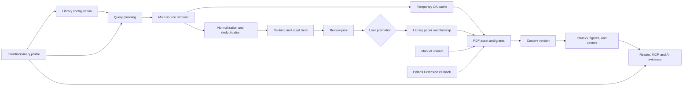

# RFC: Library-Scoped Literature Discovery and Full-Text Evidence

| Field | Value |
| --- | --- |
| Status | Draft |
| Target repository | ZJU-REAL/Polaris |
| Tracking issue | #447 |
| Author(s) | TBD |
| Updated | 2026-08-26 |

## Summary

This RFC proposes a library-scoped architecture for literature discovery, PDF
asset management, full-text processing, and evidence citation in Polaris. It
adopts proven behavior from the YFR multi-source retrieval and PDF acquisition
workflow while implementing that behavior on top of Polaris' existing library,
paper, permission, model-routing, and research-workflow boundaries. It does not
introduce a runtime dependency on an external YFR service.

Search results remain in a review pool until a user promotes them into a
library. Only promoted papers enter formal PDF processing, parsing, chunking,
vectorization, and AI evidence indexing. OA PDFs may be cached during discovery,
but the cache does not become a formal asset before promotion. Manual uploads,
OA promotion, and callbacks from the Polaris browser extension use the same
asset-ingestion service.

The RFC also defines a persistent interdisciplinary research profile. A
dedicated cross-disciplinary library, associated subject libraries, search
plans, and Agent Skills bind to the same profile version so that research
constraints remain consistent across literature discovery, ideation,
experiments, writing, and review.

## Motivation

Polaris already supports literature libraries, paper ingestion, PDF reading,
full-text chunks, vector search, Wiki compilation, MCP, and research workflows.
The following boundaries remain incomplete:

1. Search candidates and formal library papers do not have separate, traceable
   lifecycles.
2. A paper identifier such as a DOI cannot represent a PDF's provenance,
   version, or access grant.
3. Discovery-time OA caches, manual uploads, and extension callbacks do not all
   pass through one asset service.
4. MinerU, PyMuPDF, chunks, figures, vectors, and AI evidence lack a shared
   content-version contract.
5. Reprocessing can move sentence locations, so existing evidence needs version
   mapping and a stable fallback.
6. Interdisciplinary research currently depends on transient prompts rather
   than one profile shared by the project, libraries, and downstream workflows.

## Goals

- Provide multi-source discovery, review, and promotion within a selected
  literature library.
- Persist user parameters, query plans, source snapshots, scoring versions, and
  progress for every search run.
- Normalize source metadata, identifiers, deduplication rules, and failure
  semantics.
- Separate review candidates, formal paper membership, PDF bytes, asset
  provenance, and library grants.
- Allow OA caching during discovery while delaying formal processing until
  promotion.
- Route OA promotion, manual upload, and extension callbacks through one PDF
  asset service.
- Define an observable MinerU-first, PyMuPDF-fallback processing state machine.
- Version parsing output, chunks, figures, and vectors.
- Expose authorized full text to the reader, MCP, and AI workflows through one
  evidence service.
- Persist versioned interdisciplinary profiles and project-bound Agent Skills.
- Preserve conventional projects, legacy PDF fields, and existing reading paths
  during a compatibility period.

## Non-goals

- Copying the complete YFR project into Polaris or depending on an external YFR
  deployment.
- Integrating every scholarly source in the first implementation series.
- Circumventing publisher or institutional access controls.
- Expanding private or institutional PDF access because two records share a DOI.
- Removing existing PDF, full-text, or chunk fields in the initial PRs.
- Automatically deleting historical content versions.
- Committing real credentials, databases, PDFs, ZIP archives, logs, or a Native
  Messaging installer.
- Replacing the conventional project workflow with interdisciplinary logic.

## Design principles

### Literature discovery

- `requested_count` is the user-visible target; the internal candidate budget
  is stored separately.
- Start year, requested count, and selected sources are persisted in the run
  snapshot and passed to every source that supports those parameters.
- Library topics, keywords, exclusions, and scoring criteria guide query-plan
  generation; they are not treated as the final source query verbatim.
- The query planner generates, validates, and persists the executed queries.
  Interdisciplinary plans must include English queries.
- A source failure reduces coverage without failing the complete run.
- Unpromoted candidates do not trigger formal parsing, vectorization, or Wiki
  compilation.

### PDF assets

- Paper identity, PDF bytes, asset provenance, and library authorization are
  separate objects.
- PDF bytes are deduplicated by SHA-256; access is controlled by independent
  grants.
- OA assets may be reused according to their sharing policy. Institutionally
  authorized assets remain within their authorization scope. Private-library
  assets do not become visible across libraries automatically.
- Identity mismatch never overwrites an existing asset.

### Full text and evidence

- MinerU is the preferred structured parser; PyMuPDF is an observable fallback.
- Parsing output is stored as immutable content versions. Reprocessing creates a
  new version.
- The previous version remains readable until its replacement is ready.
- AI context and persisted evidence manifests use the same content version and
  the same selected chunks.
- Evidence resolves to structured sentences first and the PDF text layer second.
  A failed fine-grained resolution falls back to the paper page.

### Interdisciplinary research

- LLM output remains a draft until user confirmation and does not create formal
  project assets.
- Confirmation creates a research-profile version, a dedicated
  cross-disciplinary library, and associated-library relationships.
- Skill executions reference an explicit profile version so later edits do not
  alter historical semantics.
- Conventional projects do not load interdisciplinary constraints.

## Architecture

## Detailed design

### Search runs and query planning

A persisted `SearchRun` represents one search. Its snapshot includes at least:

- library and initiating user;
- requested result count and internal candidate budget;
- start year and optional end year;
- enabled sources and configuration version;
- topic, keywords, exclusions, and scoring criteria;
- generated query plan, query languages, and model version;
- per-source progress, error summary, and final tier statistics.

The planner converts library configuration into one or more executable queries.
A conventional library generates an English primary query and may add a Chinese
supplemental query. An interdisciplinary library generates grouped queries for
the primary subject, associated subjects, and bridge questions before fusing
the results. Invalid language, length, or source syntax may trigger bounded
regeneration; attempts and terminal reasons are persisted.

### Source adapters and normalized metadata

Sources implement one adapter contract. The initial series plans to support or
reuse OpenAlex, Semantic Scholar, Crossref, Europe PMC, arXiv, PubMed, HAL, CORE,
and Unpaywall. An adapter:

- receives normalized queries, time bounds, limits, and pagination cursors;
- returns source identifiers and normalized candidate fields;
- distinguishes rate limits, timeouts, authentication failures, empty results,
  and partial results;
- exposes source-level progress and retryability.

Normalized fields include title, abstract, authors, year, venue, DOI, PMID,
arXiv ID, Semantic Scholar ID, source URL, OA status, candidate PDF links,
citation metrics, and the raw source record. Missing fields remain null rather
than using placeholders such as "Unknown journal" in ranking inputs.

### Deduplication, fusion, and ranking

Candidate identity is resolved in this order:

1. normalized DOI;
2. PMID or PMCID;
3. arXiv ID;
4. Semantic Scholar Corpus ID;
5. normalized title, year, and author fingerprint.

Field values from multiple sources are merged using field-level provenance and
confidence. Relevance, publication quality, influence, and novelty are computed
separately and combined according to the library scoring configuration. Model
reranking operates only on candidates that pass deterministic time and quality
filters. The result stores the model, prompt version, component scores, and
explanation.

Quality gates report Precision@5, Precision@10, Precision@20, duplicate rate,
source coverage, missing-abstract rate, and latency. Interdisciplinary runs also
report subject coverage and the proportion of bridge papers.

### Review pool and paper promotion

`SearchHit` stores an unpromoted candidate and its scoring evidence without
requiring a global `Paper`. On promotion, one service resolves the normalized
identity, creates or reuses a `Paper`, and creates library membership.

Deleting a search run removes its run and candidate records but does not delete
papers already promoted. History deletion is irreversible and requires an
authorization check and an explicit response describing the deletion scope.

### Temporary OA cache

Discovery may attempt every verifiable OA PDF candidate. A successful download
creates a `SearchPdfCache` record containing candidate identity, source URL,
SHA-256, MIME type, size, validation result, and cache state.

The temporary cache does not trigger MinerU, PyMuPDF, chunking, vectors, or Wiki
compilation. After promotion, the promotion service validates identity and
authorization before converting the cache into a formal PDF asset. An
unverified cache is not bound automatically.

### PDF assets and grants

Formal PDFs use three layers:

| Object | Responsibility |
| --- | --- |
| `PdfBlob` | SHA-256, byte size, storage key, and file state |
| `PaperAsset` | Paper, provenance, identity verification, sharing scope, and preferred state |
| `AssetGrant` | Authorization for a library to read and process an asset |

Manual upload, OA promotion, arXiv acquisition, and extension callback invoke
the same service. The service validates the PDF signature and size, checks
identity, performs idempotent storage, creates grants, and dispatches processing.
Legacy `Paper.pdf_path` remains readable during the compatibility period. New
ingestion writes the asset model and projects to the legacy field only when
authorization is unambiguous.

### Full-text processing, versions, and vectors

Processing states distinguish queued, uploading to MinerU, accepted by MinerU,
processing in MinerU, MinerU retry, processing with PyMuPDF, structured ready,
plain-text ready, and failed. MinerU processing timeout starts after service
acceptance, not while waiting in the local queue.

A lease prevents concurrent work on the same asset. MinerU concurrency defaults
to two and remains administrator-configurable. Transient failures retry with
backoff. PyMuPDF fallback occurs only after a permanent error or exhausted
retries.

`ContentVersion` refers to one PDF asset and parser version. Structured Markdown,
plain text, figure manifests, chunks, and vectors all refer to that content
version. Paper-level vectors and full-text chunk vectors report separate states.

Reprocessing creates a new version. Once ready, it atomically becomes active and
the previous version becomes historical. Historical versions remain available
until evidence remapping and retention policy permit cleanup.

### Reader, MCP, and AI evidence

One authorized evidence service reads legacy and versioned full-text sources. It
returns evidence objects containing content version, page, rectangle, section
path, sentence sequence, and quoted text.

MinerU evidence resolves in the structured view while retaining a PDF page
mapping. PyMuPDF evidence uses the PDF text layer and rectangles directly. A
citation opens the PDF reader and attempts to highlight the sentence. If the
stored location fails, the resolver matches the quote against the current
authorized version; if that also fails, it opens the paper page rather than a
dead link.

Wiki compilation, idea generation, experiment workflows, paper writing, paper
review, presentations, chat, and MCP use the same evidence contract when they
read full text. A workflow without full-text authorization may use metadata and
abstracts only, and its generation context must retain that provenance boundary.

### Download backend protocol

The download backend uses user API keys, batches, and batch items. One push
creates one batch containing multiple papers. Every item retains its
`paper_id + library_id` binding, source URLs, expected identity, and independent
state.

The protocol supports claim, lease, heartbeat, retry, and idempotent archive.
An item with an existing verified PDF may skip download without losing its
archive binding. API-key storage includes only a hash, prefix, scope, status, and
timestamps. Plaintext is returned once on creation or rotation.

### Polaris Extension

The user-facing name is Polaris Extension. It receives batches, discovers or
captures PDFs in an authorized browser context, validates files, saves them to
the configured local directory, and archives them to Polaris per paper.

Reviewable source, reproducible build instructions, permission rationale,
privacy documentation, and browser tests belong in the code review. The offline
ZIP and Native Messaging installer do not belong in the source PR. The installer
is distributed as a release asset or as a separately maintained bridge.

YFR and SCNet compatibility behavior remains in optional adapters rather than
the core protocol. Use of `debugger`, `nativeMessaging`, `webRequest`, and broad
host permissions requires an explicit rationale and should be narrowed where
possible.

### Interdisciplinary research profiles

Cross-disciplinary project creation has draft and confirmation stages. Given a
project title and a one-sentence definition, the LLM asks necessary questions
and proposes the scope, core question, primary subject, associated subjects,
subject keywords, validation conditions, and rationale. A schema-repair failure
returns an editable draft without creating formal assets.

Confirmation creates an immutable profile version, a dedicated
cross-disciplinary library, and associated-subject library relationships. The
dedicated library retrieves by subject before cross-disciplinary fusion and
evidence balancing. Project overview, ideation, experiments, writing, and review
carry the same profile version.

Agent Skill templates are visible in the skill marketplace. A project binds to
an explicit template version and research-profile version. Editing the profile
creates a new version without rewriting historical executions.

## Permission model

| Operation | Creator or manager | Public-library visitor | Unauthorized user |
| --- | --- | --- | --- |
| Read public search history | Allowed | Read-only | Denied |
| Start or delete a search | Allowed | Denied | Denied |
| Promote candidates | Allowed | Denied | Denied |
| Read an OA asset | Library permission required | Library permission required | Denied |
| Read institutional or private assets | Active grant required | Only within grant scope | Denied |
| Reprocess full text | Allowed | Denied | Denied |
| Use full text in AI workflows | Paper visibility and asset grant required | Same | Denied |

After a private library becomes public, only its creator or an authorized
manager may change configuration, run searches, delete history, or promote
candidates. Other visitors retain read-only access to public results and granted
content.

## Compatibility and migration

Initial migrations add structures without removing legacy tables or columns:

1. search runs, hits, and source attempts;
2. temporary OA cache;
3. PDF blobs, assets, and grants;
4. content versions, versioned chunks, and vectors;
5. download API keys, batches, and items;
6. interdisciplinary profiles and relationship tables.

Every migration is generated from the current Alembic head with a random
revision identifier, passes upgrade/downgrade roundtrip tests, and preserves a
single head. Legacy PDFs with unknown provenance or authorization are not
automatically converted into shared assets.

Legacy writes may stop only after every PDF entry point, reader, MCP tool, Wiki
flow, and vector search path can read the new model and one release cycle has
shown no legacy-only reads.

## Observability and failure recovery

- Search runs report per-source state, candidate counts, deduplication counts,
  review progress, requested count, and remaining phases.
- Rate limits, authentication failures, timeouts, and empty results remain
  distinct failure categories.
- PDF processing reports upload, acceptance, parsing, retry, fallback, chunking,
  and vector states.
- Download batches report download, local save, identity validation, and remote
  archive status for every item.
- Asynchronous operations use idempotency keys, leases, and retryable states to
  avoid duplicate assets and duplicate parsing.
- Logs exclude API keys, signed URLs, PDF bodies, and restricted full-text
  excerpts.

## Security and privacy

- External-source credentials use existing encrypted settings and model-routing
  boundaries. They are never embedded in migrations, logs, or frontend bundles.
- Download API keys support scope, rotation, revocation, expiration, and rate
  limits.
- File delivery, structured reading, vector search, MCP, and AI context building
  all enforce paper visibility and asset grants.
- Byte deduplication never creates an implicit grant.
- The extension uploads only PDFs that the user explicitly archives and reports
  local-save and remote-archive outcomes separately.

## Implementation plan

| Stage | PR scope |
| --- | --- |
| 0 | RFC, permissions, migration, and test documentation |
| 1 | Search runs, candidates, and source contracts |
| 2 | Multi-source retrieval, query planning, deduplication, and ranking |
| 3 | Library-scoped discovery workspace |
| 4 | PDF blobs, assets, grants, and unified ingestion |
| 5 | MinerU/PyMuPDF, content versions, and vectors |
| 6 | Reader, MCP, and AI evidence resolution |
| 7 | Download batch and archive backend protocol |
| 8 | Polaris Extension |
| 9 | Interdisciplinary profiles and dedicated libraries |
| 10 | Interdisciplinary Skills and workflow injection |

Every implementation PR has an independent Issue, branch, and worktree created
from the current `origin/main`. Database, API, frontend, and extension changes
land in dependency order without long-lived stacked branches.

## Acceptance criteria

### Search

- Requested count and internal candidate budget are displayed and persisted
  independently.
- Start year reaches every source that supports year filtering.
- Fixed multi-domain topics report Precision@5/10/20, duplicate rate, source
  coverage, and latency.
- Unpromoted candidates do not create formal assets, parsing jobs, or vectors.
- Interdisciplinary plans include English primary queries and report subject
  coverage and bridge-paper ratio.

### PDF and full text

- OA promotion, manual upload, arXiv acquisition, and extension callbacks invoke
  one asset service.
- A private PDF does not become visible across libraries because the DOI matches.
- Range responses, signed URLs, PDF signatures, identity mismatch, and mobile
  reading pass tests.
- MinerU acceptance, processing, completion, rate limit, retry, and permanent
  failure states are verifiable.
- A failed reprocessing attempt leaves the prior version readable.
- Paper-level and full-text chunk vectors report independent states.

### Evidence and workflows

- AI context and evidence manifests use the same full-text chunks.
- MinerU and PyMuPDF content both participate in full-text retrieval and
  citation.
- A citation opens and highlights the PDF location when possible, then falls
  back to the paper page.
- Wiki, ideas, experiments, writing, review, presentations, chat, and MCP do not
  emit unresolvable sentence citations.
- Revoking permission prevents old citations from reading restricted full text.

### Extension and interdisciplinary workflows

- One push creates one batch containing multiple papers.
- Skipping duplicate downloads preserves per-item archive bindings.
- A locally saved PDF can retry remote archive after a temporary failure.
- Chrome integration tests cover real batch import, PDF capture, and archive.
- Formal interdisciplinary assets are not created before user confirmation.
- Profile, dedicated library, associated libraries, and Skill versions agree.
- Conventional project regression tests pass.

## Alternatives considered

### Use YFR as an external service

This would reuse existing behavior quickly, but it adds an independent
deployment, data synchronization, permission mapping, and runtime availability
dependency. This RFC does not adopt it.

### Create global papers during retrieval

This would reuse existing ingestion paths, but unreviewed candidates would
pollute the global paper pool and make deletion semantics ambiguous. This RFC
persists candidates independently and promotes them on user selection.

### Bind and share PDFs by DOI only

A DOI does not express file provenance or authorization. DOI-only sharing could
expose private PDFs across libraries. This RFC separates byte deduplication from
asset grants.

### Overwrite parsed content during reprocessing

In-place replacement is simpler but breaks existing evidence and removes the
rollback path. This RFC uses immutable content versions and an active-version
switch.

## Open decisions

1. Should candidates remain independent until promotion creates or reuses a
   global `Paper`?
2. Should PDF byte deduplication, asset provenance, and library grants remain
   separate?
3. Should processing use MinerU first, observable PyMuPDF fallback, and immutable
   content versions?
4. Should the download backend protocol live in the Polaris repository?
5. Should Polaris Extension live in the main repository or a separate official
   repository?
6. Should YFR and SCNet compatibility adapters be reviewed as optional modules?
7. Should interdisciplinary profiles, dedicated libraries, and Skills land as
   separate follow-up PRs?
